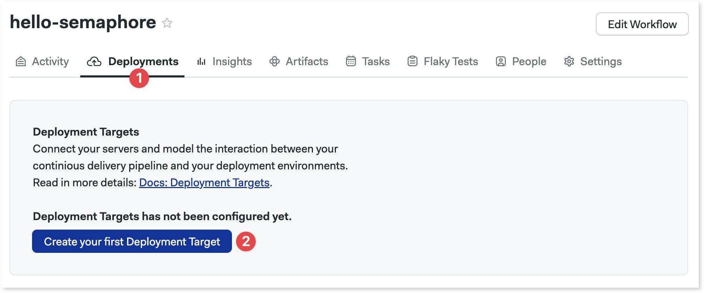
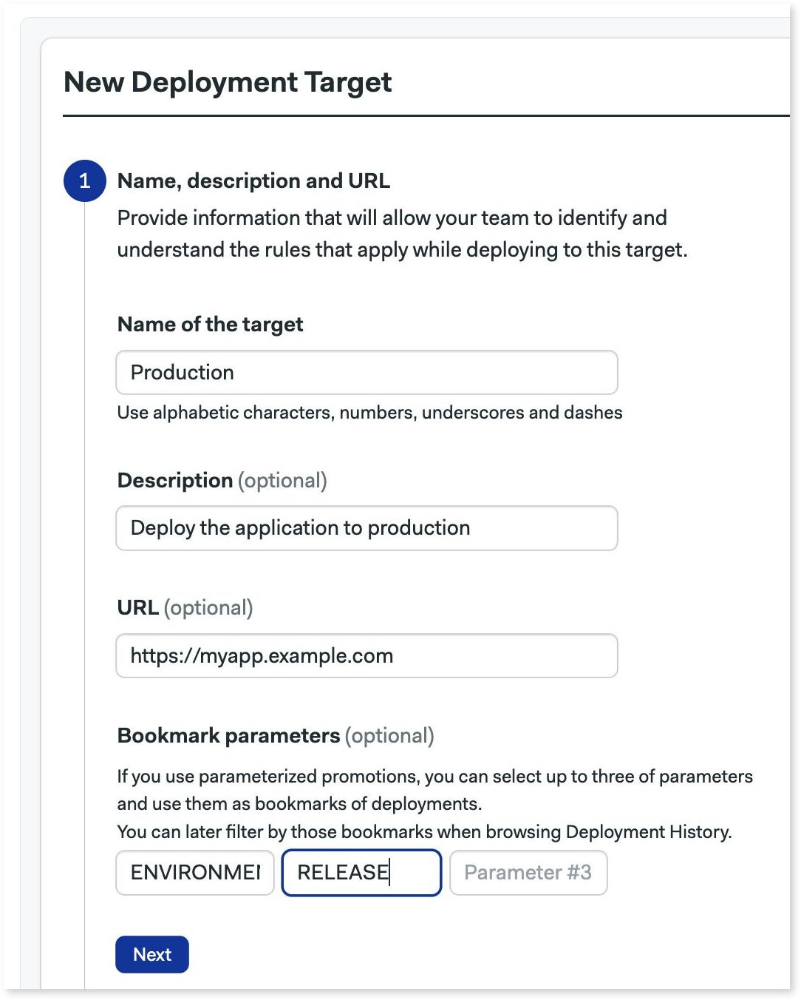
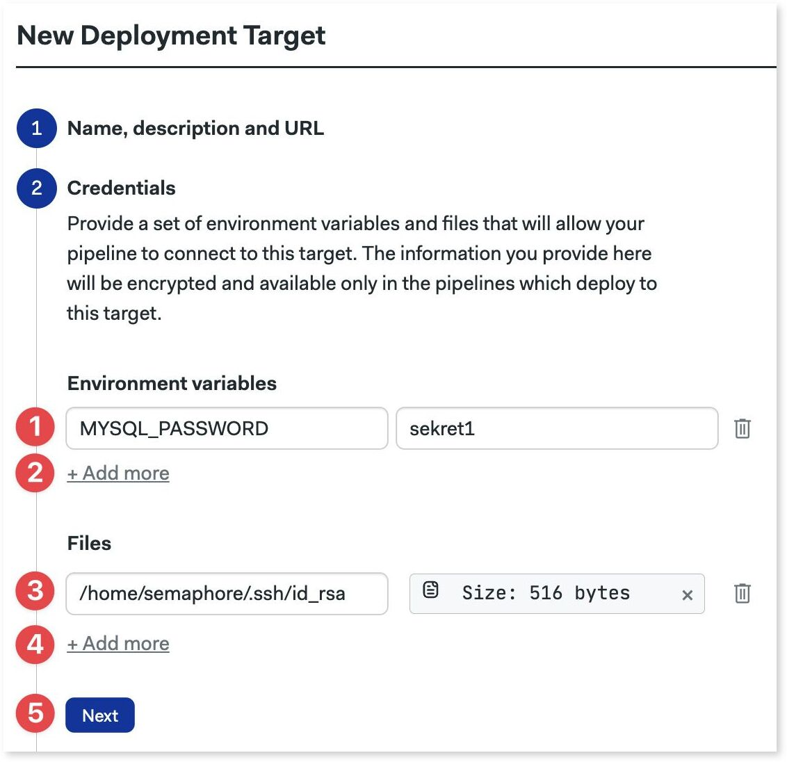
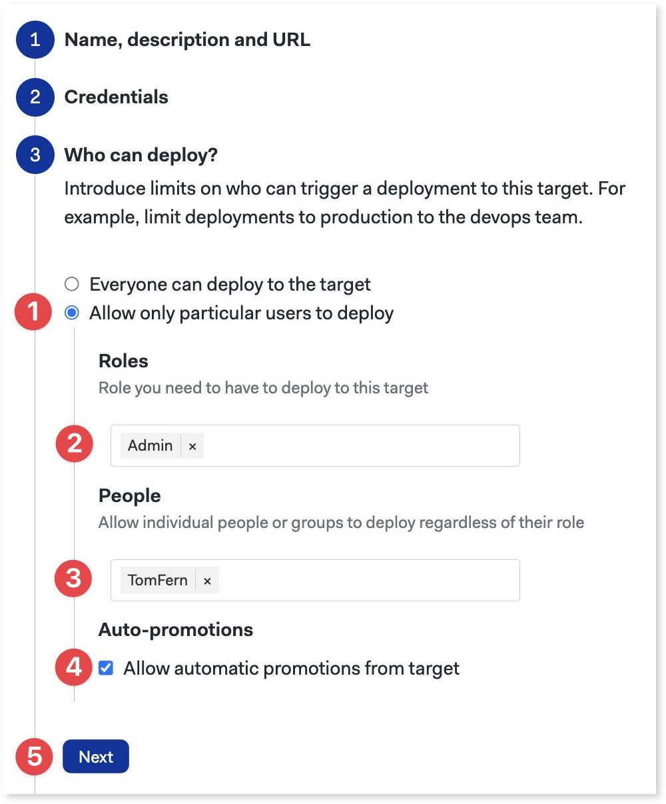
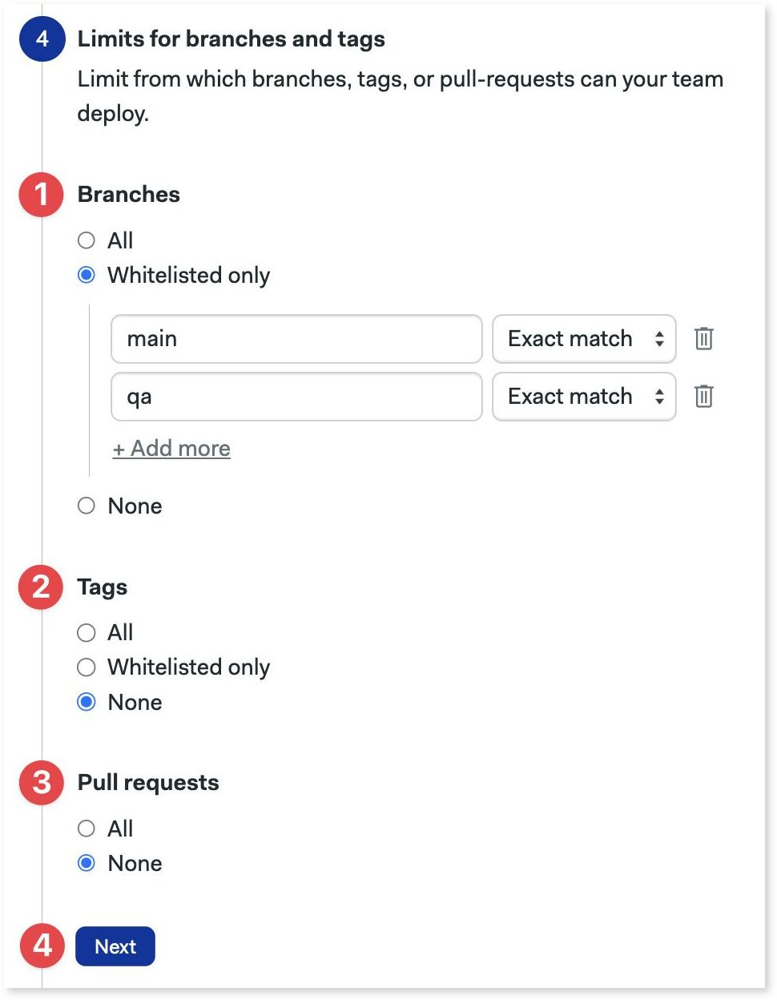
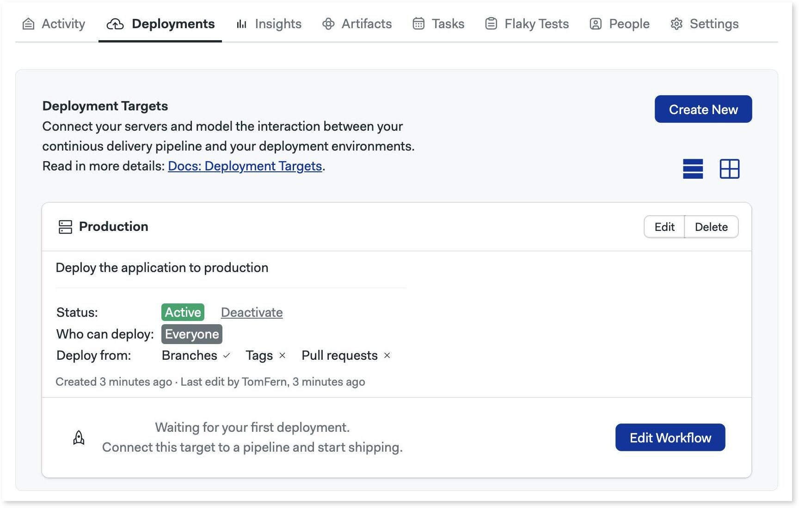
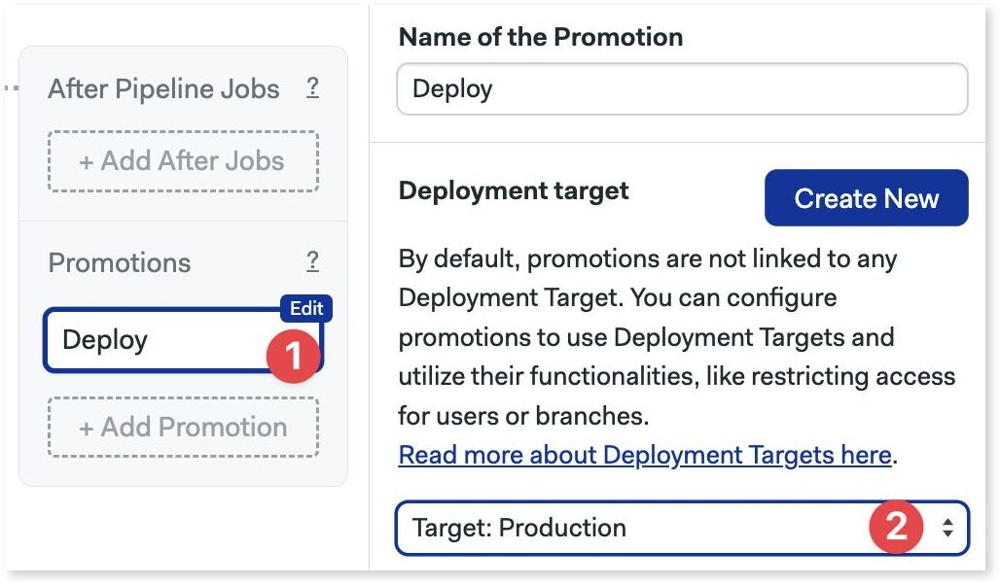
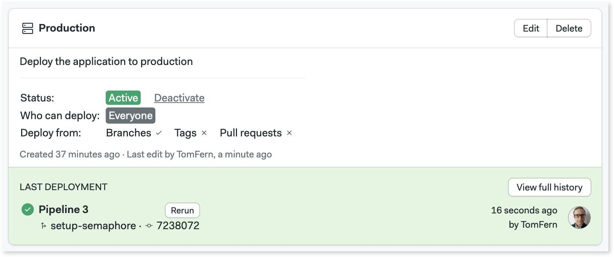
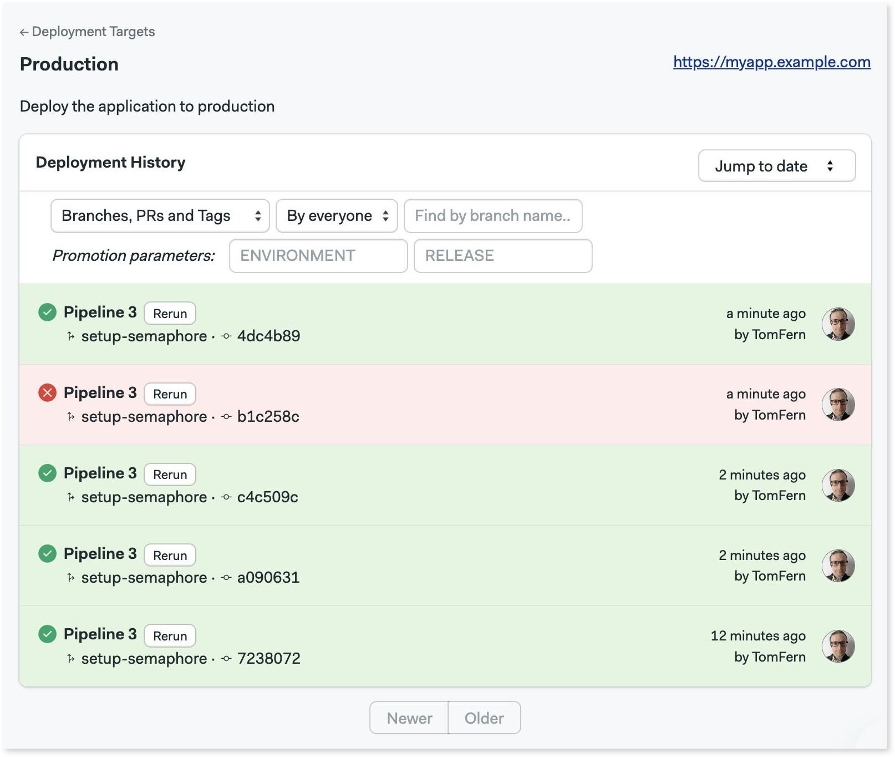
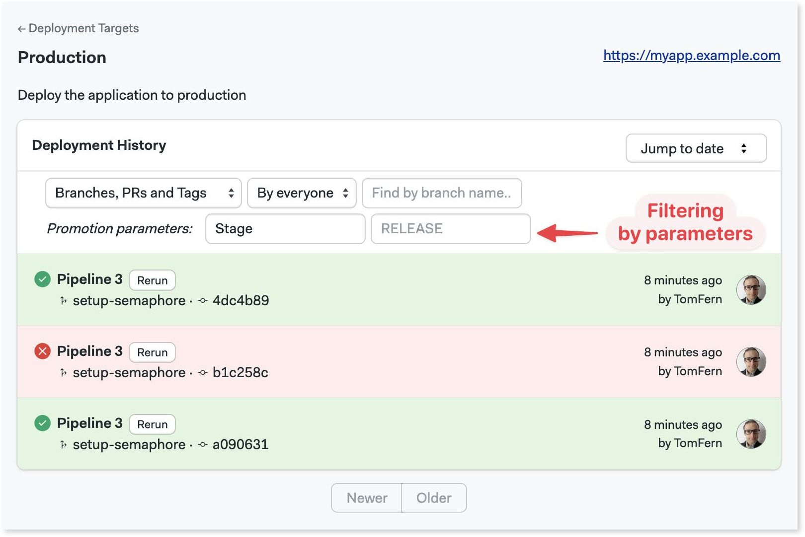

# Deployment Targets

import Tabs from '@theme/Tabs';
import TabItem from '@theme/TabItem';
import Available from '@site/src/components/Available';

## Overview

Deployment targets allow you to tightly control [promotions](./pipelines.md#promotions), preventing unauthorized users from starting a critical pipeline. In addition, deployment targets can restrict branches, pull requests, and protect *secrets*.

Configuring a deployment target is a two-step process:
1. Create a deployment target
2. Associate the target with a promotion


## How to create a deployment target {#create}

Deployment targets can be defined once and used in multiple promotions in a project.

To create a deployment target, navigate to your Semaphore project and:
1. Go to the **Deployment Targets** tab
2. Press **Create your first Deployment Target**
    <details>
        <summary>Show me</summary>
        <div>
        
        </div>
    </details>
3. Fill in the deployment details:
    - Name of the deployment
    - Optional description
    - Optional URL of the deployed application
    - Optional bookmarks
4. Press **Next**

    <details>
    <summary>Show me</summary>
    <div></div>
    </details>

The bookmarks are useful when using [parameterized promotions](./pipelines#parameters). You can add up to three bookmarks matching the names of the parameters in the promotions. Think of the bookmarks as additional filters available in the deployment history view. 

### Credentials

Credentials are a restricted type of *secrets* that are only accessible to authorized members of your organization.

In the second part of the deployment target, we can define environment variables and upload files that will be accessible to the promoted pipelines. All information will be encrypted once saved.

Credentials are optional. Go to the next step if you don't need them.

1. Set the environment variable name and value
2. Add more variables as needed
3. Upload a file and set where to put it in the [agent](./pipelines#agents)
4. Add more files as needed
5. Press **Next**

    <details>
        <summary>Show me</summary>
        <div>
        
        </div>
    </details>

### Granular permissions

<Available plans={['Scaleup']} />

In the "Who can deploy?" section you can define the users and roles that can manually start the promotion. Granular permission is optional. You can go to the next section if you don't need to restrict access to the promotion.

By default, everyone can start the promotion linked to this deployment target. To restrict access:

1. Select "Allow only particular users to deploy"
2. Optionally, select the roles that can deploy from the list
3. Optionally, select the members of your organization that can deploy
4. Uncheck the "Allow automatic promotions.." option to disallow [automatic promotions](./pipelines#automatic-promotions)
5. Press **Next**

    <details>
        <summary>Show me</summary>
        <div>
        
        </div>
    </details>

### Git-based permissions

In the fourth section of deployment targets, you can restrict which Git branches and tags are allowed to start a promotion. Here you can also block promotions coming from pull requests. This section is optional.

To restrict Git-based access:
1. Select which branches are enabled for promotions: all, none, or list of allowed branches
2. Select which Git tags are enabled: all, none, or a list of allowed tags
3. Enable or disable pull requests from triggering promotions
4. Press **Next**
5. Press **Create**

    <details>
        <summary>Show me</summary>
        <div>
        
        </div>
    </details>

Once done, you can see the created deployment targets in the Deployments tab.

:::tip Exact match or regular expressions?

Branches and tags can be matched in two ways:
- **Exact match**: strings must match exactly
- **Regex match**: strings are matched using Perl-compatible regular expressions. See the [Erlang re module documentation](https://www.erlang.org/doc/man/re.html) to see more details on the syntax

:::

## How to target promotions {#promotion}

Once you have created at least one deployment target, you can associate it with a [promotion](./pipelines#promotions). This creates a targeted promotion.



<Tabs groupId="editor-yaml">
<TabItem value="editor" label="Editor">

Press **Edit workflow** to open the visual editor and:
1. Select or create a promotion
2. In **Deployment target**, select the target from the dropdown list

Select **No target** to remove the association between the deployment target and the promotion.


</TabItem>
<TabItem value="yaml" label="YAML">

1. Edit the pipeline file with the promotion you wish to target
2. Add a `deployment_target` key to the promotion. The value is the name of the deployment target you wish to associate with this promotion

Delete `deployment_target` to remove the association between the deployment target and the promotion.

```yaml title=".semaphore/semaphore.yml"
# ...
promotions:
  - name: Promotion 1
    pipeline_file: deploy.yml
    # highlight-next-line
    deployment_target: Production
```

</TabItem>
</Tabs>

## How to start targeted promotions

[Targeted promotions](#promotion) shows a lock icon next to the promotion button. The icon will be unlocked if you have permission to start the promotion or locked if you don't.

<Tabs groupId="targeted-promotions">
<TabItem value="unlocked" label="Unlocked promotion">

The promotion is unlocked. Press the promotion button to start the next pipeline.


</TabItem>
<TabItem value="locked" label="Locked promotion">

The promotion is unlocked. The button is grayed out and you can't start the next pipeline.


</TabItem>
</Tabs>

:::warning

Anyone with write access to the repository can edit the pipeline file and remove the deployment target in the promotion.

:::

### Help! I can't start a promotion

Once a [promotion is targeted](#promotion), you may be locked out from starting it. The most common reasons that a promotion appears as blocked are:

- you don't have the correct permissions to deploy to the bound [deployment target](#overview)
- you are on a Git branch, tag, or pull request that is not allowed
- you are not logged in or you are viewing a build of a public project
- the deployment target is deactivated or deleted

### Starting promotions with the API

You can also use the *Public API (alpha)* to trigger promotions. If promotion is forbidden by the deployment target, you will receive an "HTTP 400 Bad Request" response with a reason in the body.

## How to view deployment history

The **Deployment** tab allows you to track your previous deployments. In this tab, you can see:

- how started the last deployment
- which commit was used
- what workflow does the deployment belong to

You can also stop a running pipeline or rerun a promotion if you have the right to do so.



Press **View full history** to see the latest deployments in reverse chronological order.



Use **Newer** and **Older** buttons to navigate to other pages. You can also jump to a specific date.

You can also filter deployments by:
- **type**: view branches, tags, pull requests, or everything
- **author**: everyone or just you
- **origin**: branch, tag, or pull request
- **promotion parameters**: these are the [bookmarks](#create) added to the deployment target

To filter using promotion parameters, type the value of the parameter and press Enter. This feature is useful when you have [parameterized promotions](./pipelines#promotions).


