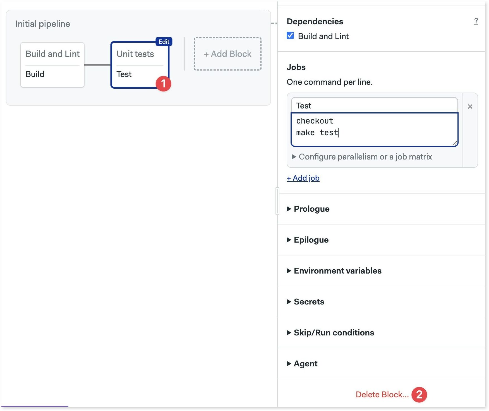
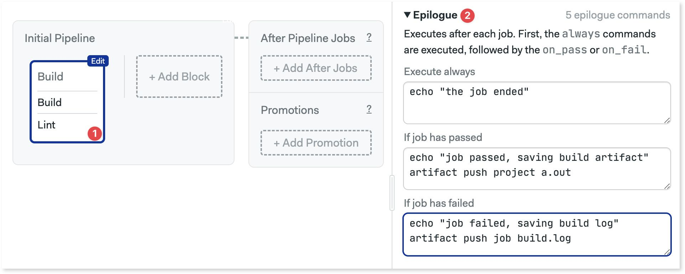
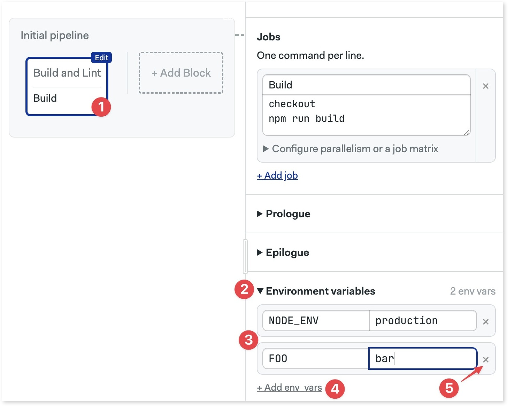
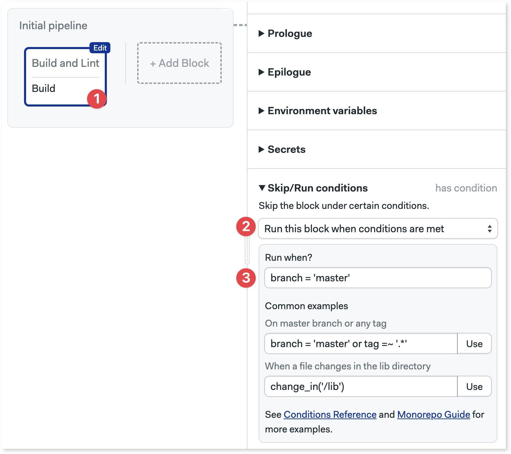

# Jobs

import Tabs from '@theme/Tabs';
import TabItem from '@theme/TabItem';

Jobs are the building blocks of Continuous Integration. Everything that happens, happens in a job. Jobs run user-defined shell commands in an *agent*, which can be a Virtual Machine (VM), a Kubernetes node, or a Docker container.

## Overview

Jobs run in their own dedicated agent, ensuring your commands run in an clean and ephemeral environment.

When a job is scheduled, Semaphore will:
1. **Schedule gent from pool**: pick a suitable agent from the warm pool of agents.
2. **Initialize environment**: execute setup steps such as importing environment variables, loading SSH keys, mounting secrets, and installing the Semaphore CLI toolbox
3. **Run commands**: execute the your commands inside the agent
4. **End job and save logs**: when the job ends, its activity log is exported and saved for future inspection
5. **Destroy agent**: the used agent is discarded.


:::info

Agents can be non-ephemeral when using self-hosted agents instead of Semaphore Cloud.

:::


### Blocks and dependencies

Jobs are grouped into blocks. Every job in Semaphore belongs in a block, even if the block only has a single job. Even when jobs are in the same block, each still runs in its own separate VM and does not share any state. 

Jobs in the same block run in parallel. In the following diagram Jobs 1, 2, and 3 of Block A run at the same time. The same happens with Jobs 1 and 2 of Block B.


Blocks can have dependencies, which force blocks to run sequentially. Below is a more complex example:
- Block B and C depend on Block A. That means that Block B and C won't start until all Block A is done. 
- Block D only starts when Block B AND Block C have finished.


<details>
  <summary>What if we removed all dependencies?</summary>
  <div>If we removed all block dependencies between blocks then all of them would run in parallel. 
  Functionally, it would be the same as having all jobs in one big block</div>
</details>

### Pipelines and workflows

A pipeline is a group of blocks, usually connected via dependencies. Pipelines are used to fulfill specific goals like build, test, or deploy. But there is no rule; you can organize your pipelines in any shape you like.

Every pipeline is stored as a separate file inside the `.semaphore` folder in your repository. Semaphore uses YAML to encode all the elements in the pipeline including blocks, jobs, and commands. For reference, here is an example pipeline with its respective YAML. We'll learn how it works in the course of this document.

<Tabs groupId="jobs">
  <TabItem value="editor" label="Editor">
  
  </TabItem>
  <TabItem value="yaml" label="YAML">
  ```yaml title=".semaphore/semaphore.yml"
  version: v1.0
  name: Initial pipeline
  agent:
    machine:
      type: e1-standard-2
      os_image: ubuntu2004
  blocks:
    - name: Build & test
      task:
        jobs:
          - name: npm test
            commands:
              - checkout
              - npm run build
              - npm test
  ```
  </TabItem>
</Tabs>

You can have as many pipelines as you like inside your repository. Pipelines can be connected using promotions to make more complex workflows.


## How to create a job

You can create a job using YAML or by editing your pipeline in the visual workflow editor.

<Tabs groupId="jobs">
  <TabItem value="editor" label="Editor" default>
    1. Press **+ Add Block**. The block settings appear on the right
    2. Type the block's name
    3. Type the job's name
    4. Type your shell commands
    
    
    To save your changes and start the job:

    1. Press on **Run the workflow**
    2. Press on **Looks good, Start**

    
  </TabItem>
  <TabItem value="yaml" label="YAML">
    1. Create a pipeline file called `.semaphore/semaphore.yml` at the repository's root
    2. Add the `name` item under `blocks`. This is the block's name
    3. Add `name` item `task.jobs`. This is the job's name
    4. Add the list of shell commands under `commands`

    ```yaml title=".semaphore/semaphore.yml"
    version: v1.0
    name: Initial pipeline
    agent:
      machine:
        type: e1-standard-2
        os_image: ubuntu2004
    # highlight-start
    blocks:
      - name: Build
        task:
          jobs:
            - name: Make
              commands:
                - checkout
                - make build
    # highlight-end
    ```
  </TabItem>
</Tabs>

Semaphore will pick up the change and automatically start your job. You can view the job's log by clicking on the job name.


## Cloning your repository with checkout

One of the first tasks for most jobs will be to clone the repository. Semaphore installs several command line utilities during VM initialization. To check out the code from your GitHub or Bitbucket repository we use checkout.

```shell
checkout
```

Checkout clones the repository in the local disk and `cd`s into it, allowing you to run commands in the codebase directly. For example:

```shell
checkout
make build
```

<details>
  <summary>Why do I need to clone the repository every time?</summary>
  <div>Remember that each job gets a brand new VM, so besides a few pre-installed utilities, there is nothing in the local disk. You have to clone the repository inside the job VM to do any work on it.</div>
</details>


## Persisting state with cache and artifact

Semaphore will create a new VM for every job. The only way to share files between jobs is by **using non-ephemeral storage**.

Semaphore Cloud provides two ways to save data between jobs:
- **cache**: attached during VM initialization. The cache is a fixed-size temporary storage and is typically used to store dependencies (like `node_modules` or `vendor`).
- **artifacts**: you can push and pull files and folders from the artifact store. Artifacts are kept until deleted but may be billed per usage depending on the plan.


## Success and failure conditions

If at least one of the commands in a job ends with non-zero exit status, the job will be *marked as failed* and the pipeline will stop with error. No new jobs will be started once a job has failed.


:::tip

If you want to keep running the job even when a command fails you can append `|| true` to the failing line. For example:

```shell
echo "the next command might fail, that's OK"
# highlight-next-line
command_that_might_fail || true
echo "continuing job..."
```

:::


## How to run jobs sequentially

If you want to run jobs one after the other, i.e. not in parallel, you must define them in separate blocks.

<Tabs groupId="jobs">
  <TabItem value="editor" label="Editor">


  1. Create the first block and job
  2. Add a second block and job
  3. Adjust dependencies to define execution order

  
  </TabItem>
  <TabItem value="yaml" label="YAML">

  1. Add a new job entry under `blocks`
  2. Add a `dependencies`. List the names of the dependent blocks.
      
  ```yaml title=".semaphore/semaphore.yml"
  version: v1.0
  name: Initial pipeline
  agent:
    machine:
      type: e1-standard-2
      os_image: ubuntu2004
  blocks:
    - name: Build
      task:
        jobs:
          - name: Make
            commands:
              - checkout
              - make build
    # highlight-start
    # block added
    - name: Test
      dependencies:
        - Build
      task:
        jobs:
          - name: Test
            commands:
              - checkout
              - make test
    # highlight-end
  ```

  </TabItem>
</Tabs>

:::info

Semaphore will always start with the blocks that have no dependencies and move along the dependency graph until all blocks are done.

:::

## How to run jobs in parallel

Blocks are groups of jobs. All jobs in the same block *run in parallel* in no specific order. 

<Tabs groupId="jobs">
  <TabItem value="editor" label="Editor">


  To run a second job that runs in parallel:

  1. Press **+ Add job**
  2. Type the job name
  3. Type the job shell commands

  


  </TabItem>
    <TabItem value="yaml" label="YAML">

  1. Add a new `name` item under `jobs`
  2. Add your shell commands (one per line) under `commands`
  3. Save the file, commit and push it to your repository

  ```yaml title=".semaphore/semaphore.yaml"
  version: v1.0
  name: Initial pipeline
  agent:
    machine:
      type: e1-standard-2
      os_image: ubuntu2004
  blocks:
    - name: Build and Lint
      dependencies: []
      task:
        jobs:
          - name: Build
            commands:
              - checkout
              - make build
          # highlight-start
          # job added
          - name: Lint
            commands:
              - checkout
              - make lint
          # highlight-end
  ```

  </TabItem>
</Tabs>

:::info

Because each job runs in a separate environment, you cannot share files or data between jobs in the same block.

:::


## How to delete a job {#delete-job}

If the block only contains the job you want to delete you must [delete the block](#block-delete) instead.

<Tabs groupId="jobs">
  <TabItem value="editor" label="Editor">

  1. Select the block containing the job you want to delete
  2. On the right menu, press the "X" symbol on the top-right side of the job.
  3. Confirm deletion

  
  </TabItem>
  <TabItem value="yaml" label="YAML">
  1. Delete the `name` entry in the block
  2. Delete all `commands` inside the job

  ```yaml title=".semaphore/semaphore.yml"
  version: v1.0
  name: Initial pipeline
  agent:
    machine:
      type: e1-standard-2
      os_image: ubuntu2004
  blocks:
    - name: Build and Lint
      dependencies: []
      task:
        jobs:
          - name: Build
            commands:
              - checkout
              - make build
          # highlight-start
          # job to delete
          - name: Lint
            commands:
              - checkout
              - make lint
          # highlight-end
  ```
  </TabItem>
</Tabs>


## How to delete a block {#block-delete}

Deleting a block also **deletes all its jobs**. You can also [delete single jobs](#delete-job).

<Tabs groupId="jobs">
  <TabItem value="editor" label="Editor">

  1. Select the block you want to delete
  2. Scroll down to the right menu. Press **Delete Block...**
  3. Confirm deletion

  

  </TabItem>
  <TabItem value="yaml" label="YAML">
  1. Find the block you wish to delete under `blocks`
  2. Delete the whole block with all its child jobs
  3. Adjust dependencies on other blocks as necessary

  ```yaml title=".semaphore/semaphore.yml"
  version: v1.0
  name: Initial pipeline
  agent:
    machine:
      type: e1-standard-2
      os_image: ubuntu2004
  blocks:
    - name: Build and Lint
      dependencies: []
      task:
        jobs:
          - name: Build
            commands:
              - checkout
              - make build
    # highlight-start
    # block to delete
    - name: Unit tests
      dependencies:
        - Build and Lint
      task:
        jobs:
          - name: Test
            commands:
              - checkout
              - make test
    # highlight-end
  ```
  </TabItem>
</Tabs>


:::warning

Deleting a block deletes all it's children jobs.

:::

## Block settings

Block settings apply to every child's job. Select any block to view its settings.

### Prologue

The prologue contains shell commands that run before every job begins. Use this to run common setup commands like downloading dependencies, setting the runtime version, or starting test services.

<Tabs groupId="jobs">
  <TabItem value="editor" label="Editor">

  1. Select the block
  2. Open the prologue section and add your shell commands
  

  </TabItem>
  <TabItem value="yaml" label="YAML">

  1. Locate the block you wish to add the prologue to
  2. Add the `prologue` under `tasks`

  ```yaml title=".semaphore/semaphore.yml"
  version: v1.0
  name: Initial pipeline
  agent:
    machine:
      type: e1-standard-2
      os_image: ubuntu2004
  blocks:
    - name: Build and Lint
      dependencies: []
      task:
        jobs:
          - name: Build
            commands:
              - make build
          - name: Lint
            commands:
              - make lint
        # highlight-start
        prologue:
          commands:
            - checkout
        # highlight-end
  ```

  </TabItem>
</Tabs>

### Epilogue

The *epilogue* contains commands to run after each job ends. There are three types of epilogue:
- **Execute always**: always runs after the job ends, even if the job failed.
- **If the job has passed**: commands to run when the job passes (all commands in the job exited with zero status).
- **If the job has failed**: commands to run when the job failed (one command in the job exited with non-zero status).

<Tabs groupId="jobs">
  <TabItem value="editor" label="Editor">

  1. Select the block to add the epilogue to
  2. Open the epilogue section and add your commands in the right box
  

  </TabItem>
  <TabItem value="yaml" label="YAML">
  1. Find the block where you wish to add the epilogue
  2. Add the `epilogue` types you wish key under `tasks`

  ```yaml title=".semaphore/semaphore.yml"
  version: v1.0
  name: Initial pipeline
  agent:
    machine:
      type: e1-standard-2
      os_image: ubuntu2004
  blocks:
    - name: Build and Lint
      dependencies: []
      task:
        jobs:
          - name: Build
            commands:
              - make build
          - name: Lint
            commands:
              - make lint
        # highlight-start
        epilogue:
          always:
            commands:
              - echo "we are done here"
          on_pass:
            commands:
              - echo "failure!"
          on_fail:
            commands:
              - echo "success"
        # highlight-end
  ```
  </TabItem>
</Tabs>


### Environment variables

Environment variables will be exported into the shell environment of every job in the block. You must supply the variable name and its value. A block can have any number of environment variables.

<Tabs groupId="jobs">
  <TabItem value="editor" label="Editor">

  To add an environment variable:
  1. Select the block
  2. Open the Environment Variables section
  3. Set your variable name and value
  4. Press **+Add env vars** if you need more variables
  5. Press the X if you need to delete a variable

  
  </TabItem>
  <TabItem value="yaml" label="YAML">

  1. Locate the block where you add the environment variables
  2. Add `env_vars` key under `task`
  3. Edit the variables `name` and `value`. You can have many variables under `env_vars`

  ```yaml title=".semaphore/semaphore.yml"
  version: v1.0
  name: Initial pipeline
  agent:
    machine:
      type: e1-standard-2
      os_image: ubuntu2004
  blocks:
    - name: Build and Lint
      dependencies: []
      task:
        jobs:
          - name: Build
            commands:
              - checkout
              - npm run build
        # highlight-start
        env_vars:
          - name: NODE_ENV
            value: production
          - name: FOO
            value: bar
        # highlight-end
  ```
  </TabItem>
</Tabs>


<details>
  <summary>Environment variables or shell exports?</summary>
  <div>
        <p>You can define block-level environment variables in two ways:</p>
        <ul>
            <li>By adding name-values under the <strong>environment variables section</strong></li>
            <li>By using export in the job command window:<pre>export NODE_ENV="production"</pre></li>
        </ul>
  </div>
</details>

### Secrets

Secrets work like environment variables. The main difference is that they are stored in encrypted format. Selecting a secret from the list will decrypt the secret and inject its files or variables into all jobs in the block.

Use secrets to store sensitive data like API keys, passwords, or SSH key files without revealing their contents.

<Tabs groupId="jobs">
  <TabItem value="editor" label="Editor">

  1. Select the block where you want to add the secrets
  2. Open the secrets section and select the secrets to import
  

  </TabItem>
  <TabItem value="yaml" label="YAML">
  1. Locate the block where you want to add the secrets
  2. Add a `secrets` key under `tasks`
  3. List the names of the secrets to import

  ```yaml title=".semaphore/semaphore.yaml"
  version: v1.0
  name: Initial pipeline
  agent:
    machine:
      type: e1-standard-2
      os_image: ubuntu2004
  blocks:
    - name: Build and Lint
      task:
        jobs:
          - name: Build
            commands:
              - checkout
              - npm run build
        # highlight-start
        secrets:
          - name: mysecret
          - name: awskey
        # highlight-end
  ```
  </TabItem>
</Tabs>


### Skip/run conditions

You can choose to skip or run the block only under certain conditions. When a block is skipped, none of the contained jobs run. 

Use cases for this feature include skipping a block on certain branches, or only running it when files in a defined folder have changed.

<Tabs groupId="jobs">
  <TabItem value="editor" label="Editor">

  1. Select the block to apply conditions
  2. To disable conditions choose "Always run this block"
  3. To enable conditions select either "Run this block when..." or "Skip this block when..."
  4. Type the conditions to run or skip the block

  

  </TabItem>
  <TabItem value="yaml" label="YAML (Run/When)">

  1. Select the block where to edit the conditions
  2. Under the block `name` add `run` and `when`
  3. Type the condition that causes the block to run

  ```yaml title=".semaphore/semaphore.yml"
  version: v1.0
  name: Initial pipeline
  agent:
    machine:
      type: e1-standard-2
      os_image: ubuntu2004
  blocks:
    - name: Build and Lint
      dependencies: []
      task:
        jobs:
          - name: Build
            commands:
              - checkout
              - npm run build
      # highlight-start
      run:
        when: branch = 'master'
      # highlight-end
  ```

  </TabItem>
  <TabItem value="yaml2" label="YAML (Skip/When)">


  1. Select the block where to edit the conditions
  2. Under the block `name`, add `skip` and `when` keys
  3. Type the condition that causes the block to be skipped

  ```yaml title=".semaphore/semaphore.yml"
  version: v1.0
  name: Initial pipeline
  agent:
    machine:
      type: e1-standard-2
      os_image: ubuntu2004
  blocks:
    - name: Build and Lint
      dependencies: []
      task:
        jobs:
          - name: Build
            commands:
              - checkout
              - npm run build
      # highlight-start
      skip:
        when: branch = 'master'
      # highlight-end
  ```

  </TabItem>
</Tabs>


### Agent

The agent is the VM type and operating system that runs the jobs. Every pipeline has a default agent, but you can override the agent for specific blocks.

<Tabs groupId="jobs">
  <TabItem value="editor" label="Editor">

  1. Select the block to override the agent
  2. Open the agent section and check the option "Override global agent definition"
  3. Select the environment type
  4. Select the OS image
  5. Select the machine type

  

  </TabItem>
  <TabItem value="yaml" label="YAML">

  1. Select the block where you want to override the agent.
  2. Add an `agent` key under the `task`
  3. Set the `machine` and `os_image`

  ```yaml title=".semaphore/semaphore.yaml"
  version: v1.0
  name: Initial pipeline
  agent:
    machine:
      type: e1-standard-2
      os_image: ubuntu2004
  blocks:
    - name: Build and Lint
      dependencies: []
      task:
        jobs:
          - name: Build
            commands:
              - checkout
              - npm run build
        # highlight-start
        agent:
          machine:
            type: e1-standard-2
            os_image: ubuntu2004
        # highlight-end
  ```
  </TabItem>
</Tabs>
