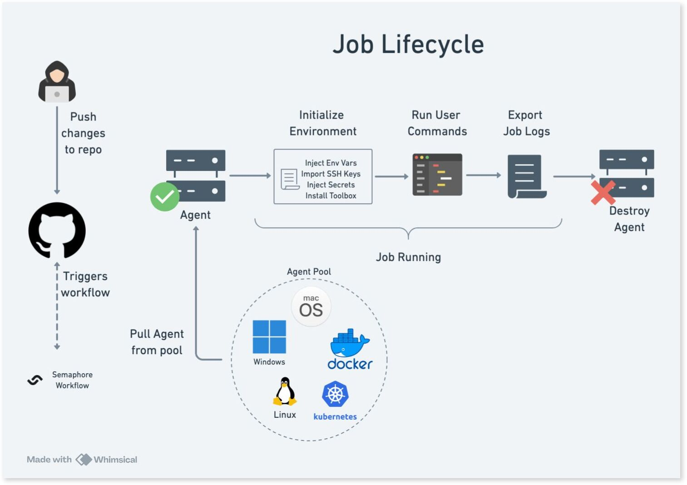
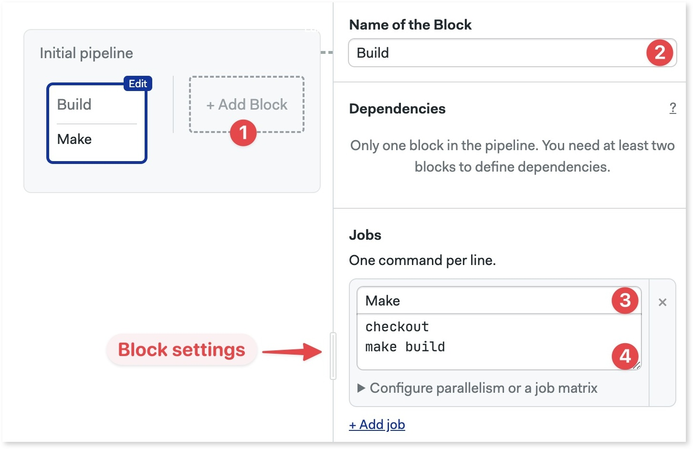
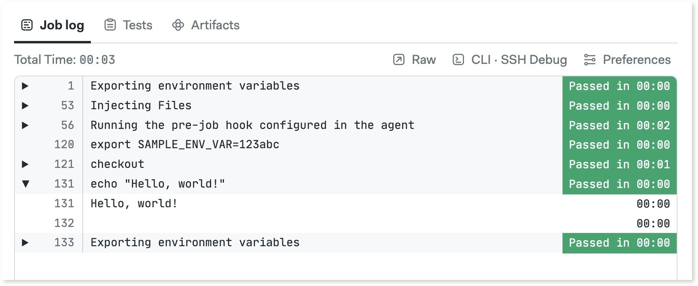
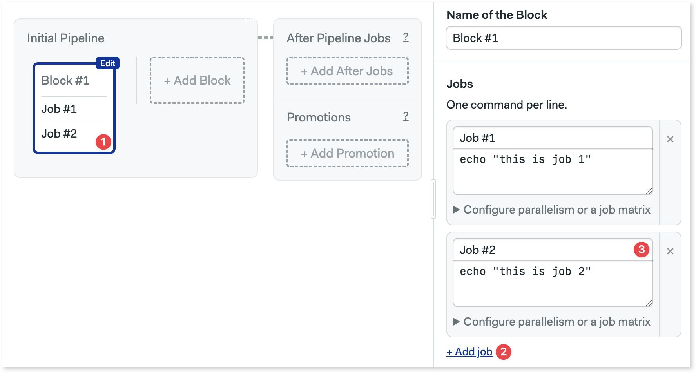
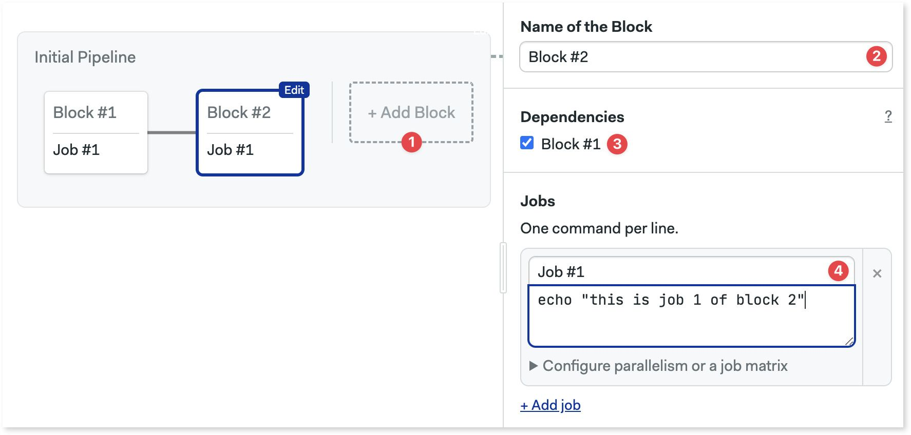

# Jobs

import Tabs from '@theme/Tabs';
import TabItem from '@theme/TabItem';
import Available from '@site/src/components/Available';

Jobs get stuff done. This page explains how jobs work, how you can configure them, and what settings are available.

## Job lifecycle

Jobs run arbitrary shell commands inside a dedicated environment called *agent*. Agents are ephemeral Docker containers, Kubernetes pods, or VMs running Linux or macOS.

When a job is scheduled, Semaphore will:

1. **Schedule agent from pool**: pick a suitable agent from the warm pool of agents.
2. **Initialize environment**: execute setup steps such as importing environment variables, loading SSH keys, mounting secrets, and installing the [Semaphore toolbox](#toolbox)
3. **Run commands**: execute your commands inside the agent
4. **End job and save logs**: the job activity log is exported and saved for future inspection
5. **Destroy agent**: the used agent is discarded, along with all its files



:::info

Agents can be non-ephemeral when using *self-hosted agents*.

:::

## Blocks {#blocks}

Every job in Semaphore exists inside a block. Blocks provide a convenient way to group jobs that share settings like [environment variables](#environment-variables). By default jobs **never share state** — even when on the same block.

Jobs in the same block *run in parallel*. Here jobs #1, #2, and #3 run simultaneously.


You can [connect blocks](./pipelines#dependencies) with dependencies to blocks to orchestrate complex workflows.

## How to create a job {#job-create}

You can create a job with the visual editor or by editing the YAML directly in the `.semaphore` folder.

<Tabs groupId="editor-yaml">
<TabItem value="editor" label="Editor" default>

Open the visual editor by pressing **Edit Workflow**.

1. Press **+ Add Block**. The block settings appear on the right
2. Type the block's name
3. Type the job's name
4. Type your shell commands

 
To save your changes and start the job:

1. Press on **Run the workflow**
2. Press on **Looks good, Start**

This will commit the changes into the remote repository and start the jobs.



</TabItem>
<TabItem value="yaml" label="YAML">

1. Create a file called `.semaphore/semaphore.yml` at the repository's root
2. Define an [agent](./pipelines#agents)
3. Create a `blocks` key and type the block's `name`
4. Add a `task.jobs` key. The value is a list of jobs
5. Type the job's `name`
6. Add the job's `commands`. The value is a list of shell commands (one line per list item)
7. Save the file, commit and push it to your remote repository

```yaml title=".semaphore/semaphore.yml"
version: v1.0
name: Initial Pipeline
agent:
  machine:
    type: e1-standard-2
    os_image: ubuntu2004
# highlight-start
blocks:
  - name: Block A
    dependencies: []
    task:
      jobs:
        - name: 'Job #1'
          commands:
            - 'echo "hello, world!"'
# highlight-end
```

</TabItem>
</Tabs>

Semaphore will detect a change in the remote repository and automatically start the job. Open the project in Semaphore to follow the progress and view the job log.



<details>
 <summary>Where are my files?</summary>
 <div>Remember that each job gets a brand new agent, so besides a few pre-installed utilities, there is nothing in the agent's disk. Semaphore provides [tools to persist files](#toolbox) and move them between jobs.</div>
</details>


## Debugging jobs

Semaphore makes it easy to troubleshoot jobs. You can debug a job [interactively with an SSH session](#ssh-into-agent) or see the job log in real time.

### Why my job has failed?

When the first command in the job ends in a non-zero status the job ends immediately with error. By default no new jobs will start once a job has failed.

Open the job log to see why it failed. The problematic command will be shown in red. You can click on the commands to expand their output.


:::tip

To keep running the job even on a failed command, append `|| true` to the problematic line. For example:

```shell
echo "the next command might fail, that's OK, I don't care"
# highlight-next-line
command_that_might_fail || true
echo "continuing job..."
```

:::

### Interactive debug with SSH {#ssh-into-agent}

You can debug a job interactively by SSHing into the agent — a particularly powerful feature for troubleshooting.


If this is the first time using an interactive session you need to:

1. Click on **SSH Debug** in the job log view
2. Open the "How to install ..." section
3. Install the *sem cli*: copy and paste the command in a terminal
4. Authorize sem cli to access your organization: copy and paste the command into a terminal

Now you can start an SSH session by copying and pasting the debug command (#5 in the screenshot above)

 ```shell
 sem debug job <job-id>
 ```


You'll be presented with a welcome message like this:

```shell
* Creating debug session for job 'd5972748-12d9-216f-a010-242683a04b27'
* Setting duration to 60 minutes
* Waiting for the debug session to boot up ...
* Waiting for ssh daemon to become ready.

Semaphore CI Debug Session.

 - Checkout your code with `checkout`
 - Run your CI commands with `source ~/commands.sh`
 - Leave the session with `exit`
```

You have entered into the agent before the actual job has started. The job commands are stored in `$HOME/commands.sh`.

To run the job in the SSH session execute:

```shell
source ~/commands.sh
```

You can actually run anything in the agent, including commands that were not actually part of the job. Exit the session to end the job. 

By default, the duration of the SSH session is limited to one hour. To run longer debug sessions, pass the duration flag to the previous command as shown below:

```shell
sem debug job <job-id> --duration 3h
```

To view the job id, open the job log. You can view the id of the job in two places:

- The URL in the browser
- The SSH Debug/Attach job tooltip

<Tabs groupId="editor-yaml">
<TabItem value="browser-url" label="URL">


</TabItem>
<TabItem value="debug-link" label="SSH Debug/Attach">


</TabItem>
</Tabs>

### Inspecting running jobs

You can use SSH to attach a console to a running job. The steps are the same as [debugging a job](#ssh-into-agent). The only difference is that Semaphore will present the following command (only while a the job is running):

```shell
sem attach <job-id>
```
You can explore running processes, inspect the environment variables, and take a peek at the log files to help identify problems with your jobs.

### Port forwarding

When SSH is not enough to troubleshoot an issue, you can forward use port forwarding to connect to services running inside the agent.

A typical use case for this feature is troubleshooting end-to-end tests. Let's say a test is failing and you can't find any obvious cause in the logs. Port forwarding the HTTP port in the agent to your local machine can reveal how the application "looks" to the tests.

To start a port-forwarding session:

```shell
sem port-forward <job-id> <local-port> <remote-port>
```

For example, to forward an application running on port 3000 to your machine on port 6000, run this while the job is running:

```shell
sem port-forward <job-id> 6000 3000
```

You can now connect to `http://localhost:6000` to view the application running remotely in the agent.

:::info

Port-forwarding only works for Virtual Machine-based agents. It's not available in [Docker environments](./pipelines#docker-environments)

:::

## Semaphore toolbox {#toolbox}

Most CI platforms provide primitives in their configd to perform standard actions. For example, GitHub Actions has a [checkout action](https://github.com/actions/checkout) while CircleCI has a [checkout step](https://circleci.com/docs/hello-world/). 

Semaphore take a different approach. Instead of providing you with special actions that add to the YAML syntax complexity, it gives you a *toolbox*. The most-used tools in the Semaphore toolbox are: 

- *checkout* to checkout the code from the remote repository
- *cache* to speed up jobs by caching downloaded files
- *artifact* tomove files between jobs and save build artifacts

### checkout {#checkout}

*Checkout* clones the remote repository and `cd`s into the cloned repository so you're ready to work.

The following example shows how to work with a Node.js project. The checkout command is needed to clone the repository so we can get `package.json` and `package-lock.json`.

```shell
checkout
npm install
```
Checkout, like all the tools in the toolbox, are shell scripts. 

All the tools in the toolbox should be added in the correct order in the command section of the job, the [block prologue/epilogue](#prologue), or in the [pipeline prologue/epilogue](./pipelines#settings).

<Tabs groupId="editor-yaml">
<TabItem value="editor" label="Editor">


</TabItem>
<TabItem value="yaml" label="YAML">

```yaml title=".semaphore/semaphore.yml"
version: v1.0
name: Initial Pipeline
agent:
  machine:
    type: e1-standard-2
    os_image: ubuntu2004
blocks:
  - name: Install
    dependencies: []
    task:
      jobs:
        - name: npm install
          commands:
            # highlight-next-line
            - checkout
            - npm install
```

</TabItem>
</Tabs>

<details>
 <summary>How does checkout work?</summary>
 <div>
 During agent initialization, Semaphore sets four *environment variables* that define how checkout works:
 - SEMAPHORE_GIT_URL: the URL of the repository (e.g. git@github.com:mycompany/myproject.git).
 - SEMAPHORE_GIT_DIR: the path where the repository will be cloned (e.g. `/home/semaphore/myproject`)
 - SEMAPHORE_GIT_SHA: the SHA key for the HEAD used for `git reset -q --hard`
 - SEMAPHORE_GIT_DEPTH: checkout does by default a shallow clone. This is the depth level for the shallow clone. Defaults to 50
 </div>
</details>

### cache {#cache}

<Available/>

The main function of the *cache* is to speed up job execution by caching downloaded files. As a result, it's a totally optional feature. 

Cache can detect dependency folders. Let's say we want to speed up `npm install`:

```shell
checkout
# highlight-next-line
cache restore
npm install
# highlight-next-line
cache store
```

The highlighted lines show how to use the cache:

- **cache store**: saves `node_modules` to non-ephemeral storage. It knows it's a Node project because it found `package.json` in the working folder.
- **cache restore**: retrieves the cached copy of `node_modules` to the working directory.

Cache is not limited to Node.js. It works with several languages and frameworks. Also, you can use cache with any kind of file or folder but in that case, you need to *supply additional arguments*.

### artifact {#artifact}

<Available/>

The *artifact* command can be used as:

- a way to move files between jobs and runs
- as persistent storage for artifacts such as compiled binaries or bundles

The following example shows how to persist files between jobs. In the first job we have:

```shell
checkout
npm run build
artifact push workflow dist
```

In the following jobs, we can access the content of the dist folder with:

```shell
artifact pull workflow dist
```

Let's do another example: this time we want to save the compiled binary `hello.exe`:

```shell
checkout
go build 
artifact push project hello.exe
```

Artifacts can be viewed and downloaded from the Semaphore project.


<details>
 <summary>Artifact namespaces</summary>
 <div>
    Semaphore has three separate namespaces of artifacts: job, workflow, and project. The syntax is:

    ```shell
    artifact pull|push job|workflow|project /path/to/file/or/folder
    ```

    The namespace used controls at what level the artifact is accessible:

    - job artifacts are only accessible to the job that created it. Useful for collecting debugging data
    - workflow artifacts are accessible to all jobs in all running [pipelines](./pipelines). The main use case is to *pass data between jobs*.
    - project artifacts are always accessible. They are ideal for storing final deliverables. 

 </div>
</details>

## Blocks {#blocks}

Blocks are groups of jobs that run in parallel, in no specific order. [Block settings](#block-settings) are applied to all jobs in the block.

### Jobs in parallel {#jobs-parallel}

<Tabs groupId="editor-yaml">
<TabItem value="editor" label="Editor">

To run a two jobs in parallel:

1. Press **+ Add job**
2. Type the job name
3. Type the job shell commands



Press:

- (A) X next to the job to delete a job
- (B) "Delete block" to delete all jobs

</TabItem>
<TabItem value="yaml" label="YAML">

1. Add a new `name` item under `jobs`
2. Add your shell commands (one per line) under `commands`
3. Save the file, commit and push it to your repository

```yaml title=".semaphore/semaphore.yaml"
version: v1.0
name: Initial Pipeline
agent:
  machine:
    type: e1-standard-2
    os_image: ubuntu2004
blocks:
  - name: Build
    dependencies: []
    task:
      jobs:
        - name: Build
          commands:
            - checkout
            - make build
        # highlight-start
        - name: Lint
          commands:
            - checkout
            - make lint
        # highlight-end
```

</TabItem>
</Tabs>

:::warning

Because each job runs in a separate environment, you cannot share files or data between jobs in the same block.

:::

### Jobs in sequence {#jobs-sequence}

If you want to run jobs one after the other, i.e. not in parallel, you must define them in separate blocks.

<Tabs groupId="editor-yaml">
<TabItem value="editor" label="Editor">

1. Create the first block and job
2. Add a second block and job
3. Adjust dependencies to define execution order



</TabItem>
<TabItem value="yaml" label="YAML">

1. Add a new job entry under `blocks`
2. Add a `dependencies`. List the names of the dependent blocks.
 
```yaml title=".semaphore/semaphore.yml"
version: v1.0
name: Initial Pipeline
agent:
  machine:
    type: e1-standard-2
    os_image: ubuntu2004
blocks:
  - name: Build
    dependencies: []
    task:
      jobs:
        - name: Build
          commands:
            - checkout
            - make build
  # highlight-start
  - name: Test
    dependencies:
      - Build
    task:
      jobs:
        - name: Test
          commands:
            - checkout
            - make test
  # highlight-end
```

</TabItem>
</Tabs>

:::info

Semaphore will always start with the blocks that have no dependencies and move along the dependency graph until all blocks are done.

:::

## Block settings {#block-settings}

Block settings apply to every job inside. Select a block to view its settings.

### Prologue {#prologue}

The prologue contains shell commands that run before every job begins. Use this to run common setup commands like downloading dependencies, setting the runtime version, or starting test services.

<Tabs groupId="editor-yaml">
<TabItem value="editor" label="Editor">

1. Select the block
2. Open the prologue section and add your shell commands


</TabItem>
<TabItem value="yaml" label="YAML">

1. Locate the block you wish to add the prologue to
2. Add the `prologue` under `tasks`

```yaml title=".semaphore/semaphore.yml"
version: v1.0
name: Initial Pipeline
agent:
  machine:
    type: e1-standard-2
    os_image: ubuntu2004
blocks:
  - name: Build
    dependencies: []
    task:
      # highlight-start
      prologue:
        commands:
          - checkout
      # highlight-end
      jobs:
        - name: Build
          commands:
            - make build
        - name: Lint
          commands:
            - make lint
```

</TabItem>
</Tabs>

### Epilogue

The *epilogue* contains commands to run after each job ends. There are three types of epilogue:
- **Execute always**: always runs after the job ends, even if the job failed.
- **If the job has passed**: commands to run when the job passes (all commands in the job exited with zero status).
- **If the job has failed**: commands to run when the job failed (one command in the job exited with non-zero status).

<Tabs groupId="editor-yaml">
<TabItem value="editor" label="Editor">

1. Select the block to add the epilogue to
2. Open the epilogue section and add your commands in the right box


</TabItem>
<TabItem value="yaml" label="YAML">

1. Find the block where you wish to add the epilogue
2. Add the `epilogue` types you wish key under `tasks`

```yaml title=".semaphore/semaphore.yml"
version: v1.0
name: Initial Pipeline
agent:
  machine:
    type: e1-standard-2
    os_image: ubuntu2004
blocks:
  - name: Build
    dependencies: []
    task:
      # highlight-start
      epilogue:
        always:
          commands:
            - echo "we're done here"
        on_pass:
          commands:
            - echo "failure!"
        on_fail:
          commands:
            - echo "success"
      # highlight-end
      jobs:
        - name: Build
          commands:
            - make build
        - name: Lint
          commands:
            - make lint
```

</TabItem>
</Tabs>


### Environment variables {#environment-variables}

Environment variables will be exported into the shell environment of every job in the block. You must supply the variable name and its value. A block can have any number of environment variables.

<Tabs groupId="editor-yaml">
<TabItem value="editor" label="Editor">

To add an environment variable:
1. Select the block
2. Open the Environment Variables section
3. Set your variable name and value
4. Press **+Add env vars** if you need more variables
5. Press the X if you need to delete a variable


</TabItem>
<TabItem value="yaml" label="YAML">

1. Locate the block where you add the environment variables
2. Add `env_vars` key under `task`
3. Edit the variables `name` and `value`. You can have many variables under `env_vars`

```yaml title=".semaphore/semaphore.yml"
version: v1.0
name: Initial Pipeline
agent:
  machine:
    type: e1-standard-2
    os_image: ubuntu2004
blocks:
  - name: Build
    dependencies: []
    task:
      # highlight-start
      env_vars:
        - name: NODE_ENV
          value: production
        - name: FOO
          value: bar
      # highlight-end
      jobs:
        - name: Build
          commands:
            - checkout
            - npm run build
```

:::info

Numeric values need to be included in quotes.

:::

</TabItem>
</Tabs>

<details>
 <summary>Environment variables or shell exports?</summary>
 <div>

    You can define environment variables in two ways:

    - by putting them to the [environment variables](#environment-variables) section
    - by using `export` commands in the job window: `export NODE_ENV="production"`

 </div>
</details>

### Secrets {#secrets}

Secrets work like environment variables. The main difference is that they are stored in encrypted format. Selecting a secret from the list will decrypt the secret and inject its files or variables into all jobs in the block.

Use secrets to store sensitive data like API keys, passwords, or SSH key files without revealing their contents.

<Tabs groupId="editor-yaml">
<TabItem value="editor" label="Editor">

1. Select the block where you want to add the secrets
2. Open the secrets section and select the secrets to import


</TabItem>
<TabItem value="yaml" label="YAML">

1. Locate the block where you want to add the secrets
2. Add a `secrets` key under `tasks`
3. List the names of the secrets to import

```yaml title=".semaphore/semaphore.yaml"
version: v1.0
name: Initial Pipeline
agent:
  machine:
    type: e1-standard-2
    os_image: ubuntu2004
blocks:
  - name: Build
    dependencies: []
    task:
      # highlight-start
      secrets:
        - name: mysecret
      # highlight-end
      jobs:
        - name: Build
          commands:
            - checkout
            - npm run build
```

</TabItem>
</Tabs>


### Skip/run conditions

You can choose to skip or run the block only under certain conditions. When a block is skipped, none of the contained jobs run. 

Use cases for this feature include skipping a block on certain branches, or only running it when files in a defined folder have changed.

<Tabs groupId="editor-yaml">
<TabItem value="editor" label="Editor">

1. Select the block to apply conditions
2. To disable conditions choose "Always run this block"
3. To enable conditions select either "Run this block when..." or "Skip this block when..."
4. Type the conditions to run or skip the block


</TabItem>
<TabItem value="yaml" label="YAML (Run/When)">

1. Select the block where to edit the conditions
2. Under the block `name` add `run` and `when`
3. Type the condition that causes the block to run

```yaml title=".semaphore/semaphore.yml"
version: v1.0
name: Initial Pipeline
agent:
  machine:
    type: e1-standard-2
    os_image: ubuntu2004
blocks:
  - name: Build
    dependencies: []
    # highlight-start
    run:
      when: branch = 'master'
    # highlight-end
    task:
      jobs:
        - name: Build
          commands:
            - checkout
            - npm run build
```

</TabItem>
<TabItem value="yaml2" label="YAML (Skip/When)">


1. Select the block where to edit the conditions
2. Under the block `name`, add `skip` and `when` keys
3. Type the condition that causes the block to be skipped

```yaml title=".semaphore/semaphore.yml"
version: v1.0
name: Initial Pipeline
agent:
  machine:
    type: e1-standard-2
    os_image: ubuntu2004
blocks:
  - name: Build
    dependencies: []
    # highlight-start
    skip:
      when: branch = 'master'
    # highlight-end
    task:
      jobs:
        - name: Build
          commands:
            - checkout
            - npm run build
```

</TabItem>
</Tabs>


### Agent {#agent-override}

Here you can override the pipeline-level [agent](./pipelines#agents) for a specific job.

<Tabs groupId="editor-yaml">
<TabItem value="editor" label="Editor">

1. Select the block to override the agent
2. Open the agent section and check the option "Override global agent definition"
3. Select the environment type
4. Select the OS image
5. Select the machine type


</TabItem>
<TabItem value="yaml" label="YAML">

1. Select the block where you want to override the agent.
2. Add an `agent` key under the `task`
3. Set the `machine` and `os_image`

```yaml title=".semaphore/semaphore.yaml"
version: v1.0
name: Initial Pipeline
agent:
  machine:
    type: e1-standard-2
    os_image: ubuntu2004
blocks:
  - name: Build
    dependencies: []
    task:
      # highlight-start
      agent:
        machine:
          type: e1-standard-2
          os_image: ubuntu2004
      # highlight-end
      jobs:
        - name: Build
          commands:
            - checkout
            - npm run build
```

</TabItem>
</Tabs>
