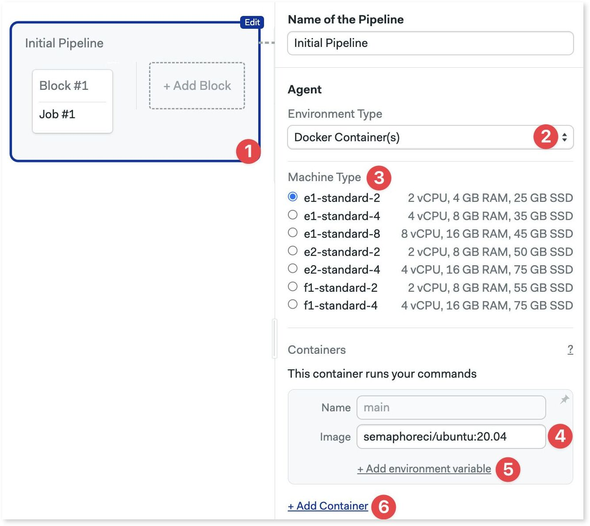
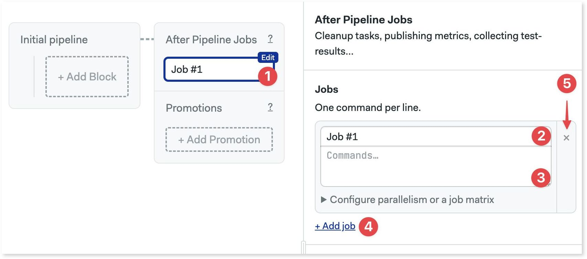

# Pipelines

import Tabs from '@theme/Tabs';
import TabItem from '@theme/TabItem';
import Available from '@site/src/components/Available';

Pipelines connect blocks to plan the execution order. All you need to do is declare the dependencies of each block and Semaphore figures out the rest.

## Overview {#overview}

The main purpose of a pipeline is to connect blocks using dependencies. This lets your plan in what order blocks and jobs run. 

Pipelines are also the unit of configuration. Each pipeline is encoded as a YAML file.  By default, Semaphore looks for the first pipeline in the path `.semaphore/semaphore.yml` relative to the root of your repository. 

For reference, here is an example pipeline with its respective YAML.

<Tabs groupId="editor-yaml">
<TabItem value="editor" label="Example pipeline">

 

</TabItem>
<TabItem value="yaml" label="YAML">

```yaml title=".semaphore/semaphore.yml"
version: v1.0
name: Initial Pipeline
agent:
  machine:
    type: e1-standard-2
    os_image: ubuntu2004
blocks:
  - name: Build
    task:
      jobs:
        - name: Build
          commands:
            - checkout
            - echo "build commands here"
  - name: Test
    dependencies:
      - Build
    task:
      jobs:
        - name: Unit tests
          commands:
            - checkout
            - echo "unit tests commands here"
        - name: Integration tests
          commands:
            - checkout
            - echo "integration tests commands here"
  - name: UI Tests
    dependencies:
      - Test
    task:
      jobs:
        - name: UI Test
          commands:
            - checkout
            - echo "UI tests commands here"
```

</TabItem>
</Tabs>

Pipelines can be chained using [promotions](./promotions) to create branching workflows and implement continuous delivery.

## Block execution order {#dependencies}

TODO: needs more work

A pipeline is a group of blocksobs#blocks) connected by dependencies. Semaphore automatically computes the execution graph based on the declared block dependencies.

In the following example:

- Block B and C depend on Block A. So, Block B and C won't start until all Block A is done. 
- Block D only starts when Block B AND Block C have finished.


TODO: animation/video showing how dependencies work

<details>
 <summary>What if we removed all dependencies?</summary>
 <div>If we removed dependencies between blocks then all of them would run in parallel. 
 Functionally, it would be the same as having all jobs in one big block</div>
</details>

## Pipeline settings {#settings}

Pipeline settings are applied to all jobs it contains. You can change pipeline settings with the editor or directly in the YAML.

### Agents {#agents}

<Available/>

Agents are the environment where jobs run. Semaphore keeps a pool of warm agents at all times to be sure there's always one ready to work.

Semaphore Cloud provides the following agent types:
- _Linux Machines_ presented as VMs or [Docker containers](#docker-environments)
- _Apple macOS Machines_

:::info

You can register additional machines as agents for your organization by _installing self-hosted agents_.

:::

To select the agent running your jobs by default:

<Tabs groupId="editor-yaml">
<TabItem value="editor" label="Editor">

1. Select the pipeline
2. Select the "Environment Type": Linux, Mac, or Docker
3. Select the "Operating System" version
4. Select the _machine type_

The available hardware changes depending on the type of environment you selected.


</TabItem>
<TabItem value="yaml" label="YAML">

1. Add the `agent` and `machine` keys
2. Add the hardware `type`. The value must be one of the supported _machine types_
3. Add the `os_image`. Value must be one of the supported _operating systems_

```yaml title=".semaphore/semaphore.yml"
version: v1.0
name: Initial Pipeline
# highlight-start
agent:
  machine:
    type: e1-standard-2
    os_image: ubuntu2004
# highlight-end
blocks:
  - name: 'Block #1'
    dependencies: []
    task:
      agent:
        machine:
          type: e1-standard-2
          os_image: ubuntu2004
      jobs:
        - name: 'Job #1'
          commands:
            - checkout
```

</TabItem>
</Tabs>

### Docker containers {#docker-environments}

Jobs can run inside Docker containers. This allows you to define a custom-build environment with pre-installed tools and dependencies needed for your project.

You can run multiple containers at the same time. The job runs in the first container (called `main`) and connect the rest of the containers to the same network. You can reach the other containers using their names as DNS records are injected into the main container.


:::tip

If you want to build and run Docker images in your jobs, check the _working with Docker Images documentation_.

:::

To run the job inside a Docker container:

<Tabs groupId="editor-yaml">
<TabItem value="editor" label="Editor">

1. Select the pipeline
2. In "Environment Types" select "Docker Container(s)"
3. Select the _machine type_
4. Type the name of the container
5. Optionally, add environment variables
6. Optionally, add more containers



</TabItem>
<TabItem value="yaml" label="YAML">

1. Add the `agent` and `machine`
2. Add a `containers` key
3. Each list item is a container. The first one must be called `main`
4. Add the `image`
5. Optionally add more containers

```yaml title=".semaphore/semaphore.yml"
version: v1.0
name: Initial Pipeline
agent:
  machine:
    type: e1-standard-2
    os_image: ubuntu2004
  # highlight-start
  containers:
    - name: main
      image: 'semaphoreci/ubuntu:20.04'
    - name: web
      image: nginx
  # highlight-end
blocks:
  - name: 'Block #1'
    dependencies: []
    task:
      agent:
        machine:
          type: e1-standard-2
          os_image: ubuntu2004
      jobs:
        - name: 'Job #1'
          commands:
            - 'curl http://web'
```

</TabItem>
</Tabs>

:::warning

Due to the introduction of [Docker Hub rate limits](https://docs.semaphoreci.com/ci-cd-environment/docker-authentication/), Semaphore automatically redirects any image pulls from the semaphoreci Docker Hub repository to the _Semaphore Container Registry_.

:::

### Other settings {#settings}

<Tabs groupId="editor-yaml">
<TabItem value="editor" label="Editor">

 

</TabItem>
<TabItem value="yaml" label="YAML">

```yaml title=".semaphore/semaphore.yml"
version: v1.0
name: Initial Pipeline
agent:
  machine:
    type: e1-standard-2
    os_image: ubuntu2004
# highlight-start
execution_time_limit:
  hours: 2
fail_fast:
  stop:
    when: 'true'
auto_cancel:
  running:
    when: 'true'
global_job_config:
  prologue:
    commands:
      - checkout
  epilogue:
    always:
      commands:
        - echo "this is always executed"
    on_pass:
      commands:
        - echo "job finished success"
    on_fail:
      commands:
        - echo "job finished failure"
# highlight-end
blocks:
  - name: Build
    dependencies: []
    task:
      agent:
        machine:
          type: e1-standard-2
          os_image: ubuntu2004
      jobs:
        - name: Build
          commands:
            - checkout
            - npm run build
```

</TabItem>
</Tabs>


The pipeline settings are:

1. **Agent**: the [agent environment](#agents) where the jobs in the pipeline runs [unless overriden](./jobs#agent-override)
2. **Machine Type**: the hardware where the jobs run. Semaphore Cloud provides several _machine types_ out of the box. You can add more types using _self-hosted agents_
3. **Prologue**: similar to the [block prologue](./jobs#prologue), these commands are prepended to the job commands in the pipeline
4. **Epilogue**: like the [block epilogue](./jobs#epilogue), these commands are appended to the job commands in the pipeline. You add commands that are executed when the job passes, fails, or always runs.
5. **Execution time limit**: time limit for job execution. Defaults to 1 hour. Any jobs running longer than this limit are forcibly stopped
6. **Fail-fast**: defines what to do when a job fails. Here you can configure the Semaphore to stop all running jobs as soon as one fails or set custom behaviors
7. **Auto-cancel**: define what happens if changes are pushed to the repository while a pipeline is running. By default, Semaphore queues these runs. You can, for example, stop the current pipeline and run the newer commits instead
8. **YAML file path**: you can override where the pipeline config file is located in your repository


### After pipeline jobs {#after-pipeline-job}

You can configure jobs to run once a pipeline stops, even if it ended due to a failure, stopped, or canceled.

After-pipeline jobs are executed in parallel. Typical use cases for after-pipeline jobs are sending notifications, collecting [test reports](./test-reports), or submitting metrics to an external server.

You can add after-pipeline jobs using YAML or the editor.

<Tabs groupId="editor-yaml">
<TabItem value="editor" label="Editor">

1. Press **+Add After Jobs**
2. Type the name of the job
3. Add your commands
4. Optionally, you can add more jobs
5. To delete them, click the X next to the job



</TabItem>
<TabItem value="yaml" label="YAML">

1. Add `after_pipeline` key at the top level of the YAML.
2. Create a `task.jobs` key
3. Add the list of jobs with `name` and `commands`

```yaml title=".semaphore/semaphore.yml"
version: v1.0
name: Initial Pipeline
agent:
  machine:
    type: e1-standard-2
    os_image: ubuntu2004
blocks:
  - name: 'Block #1'
    dependencies: []
    task:
      agent:
        machine:
          type: e1-standard-2
          os_image: ubuntu2004
      jobs:
        - name: 'Job #1'
          commands:
            - checkout
            - make build
# highlight-start
after_pipeline:
  task:
    jobs:
      - name: Submit metrics
        commands:
          - export DURATION_IN_MS=$((SEMAPHORE_PIPELINE_TOTAL_DURATION * 1000))
          - 'echo "ci.duration:${DURATION_IN_MS}|ms" | nc -w 3 -u statsd.example.com'
# highlight-end
```

</TabItem>
</Tabs>
