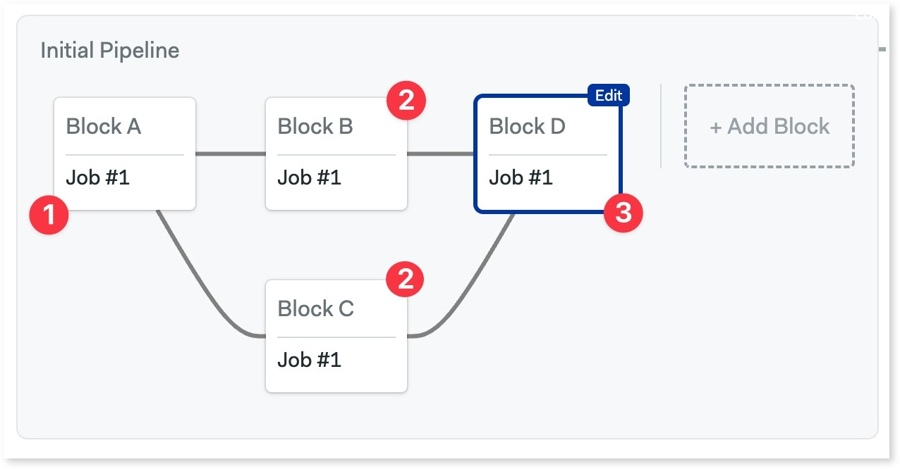
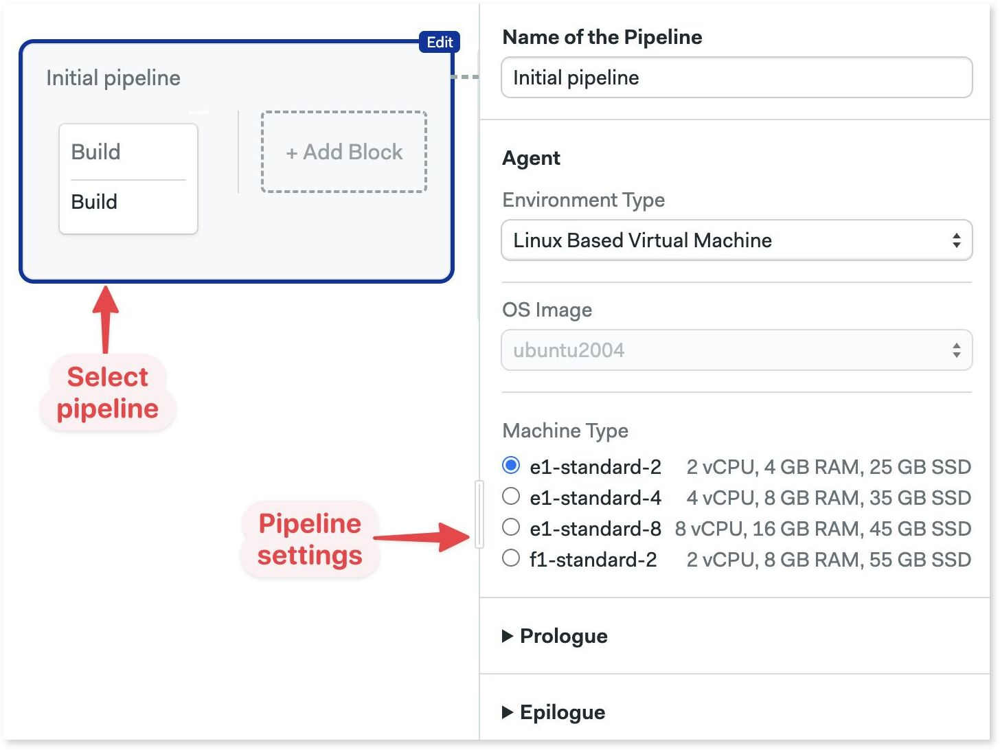
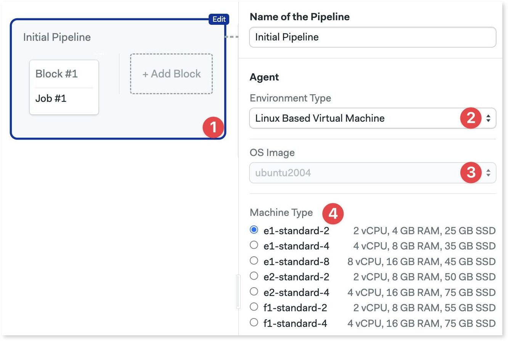
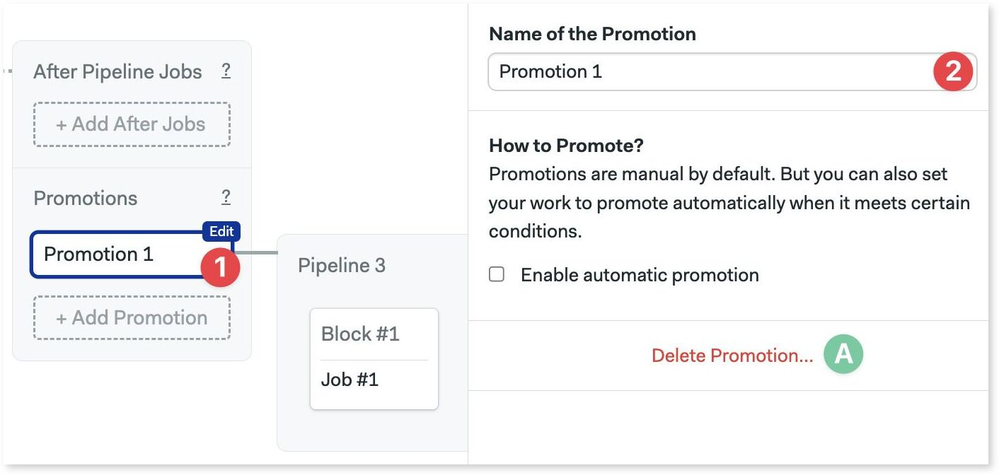
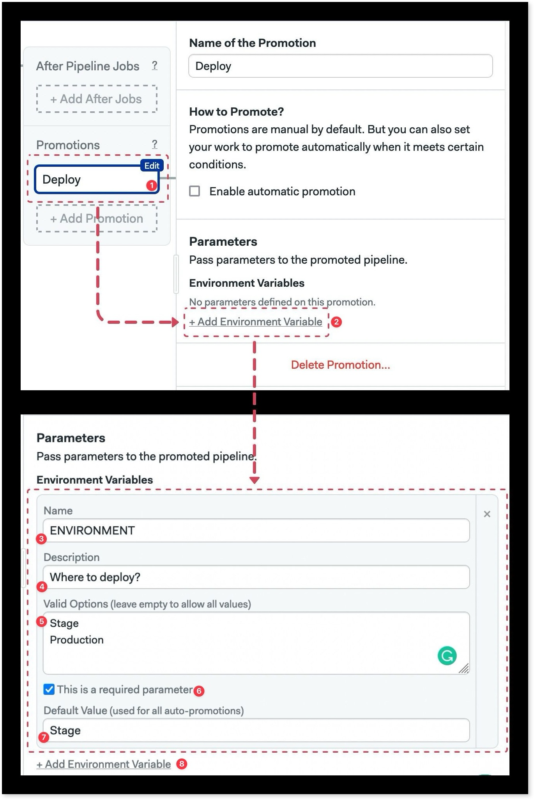
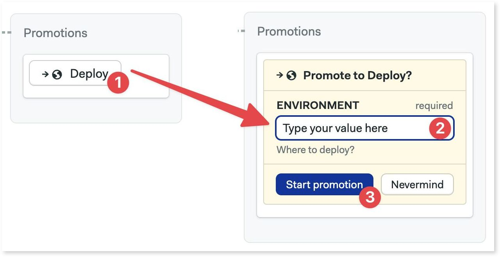

# Pipelines

import Tabs from '@theme/Tabs';
import TabItem from '@theme/TabItem';

## Overview

The pipeline is the configuration unit. Each pipeline is encoded as a YAML file. By default, Semaphore will look for the first pipeline in the path `.semaphore/semaphore.yml` relative to the root of your repository. 

For reference, here is an example pipeline with its respective YAML.

<Tabs groupId="editor-yaml">
 <TabItem value="editor" label="Example pipeline">
 
 </TabItem>
 <TabItem value="yaml" label="YAML">
 ```yaml title=".semaphore/semaphore.yml"
 version: v1.0
 name: Initial pipeline
 agent:
 machine:
 type: e1-standard-2
 os_image: ubuntu2004
 blocks:
 - name: Build
 task:
 jobs:
 - name: Build
 commands:
 - checkout
 - npm install
 - npm run build
 - artifact push workflow dist
 - name: Test
 dependencies:
 - Build
 task:
 jobs:
 - name: Unit tests
 commands:
 - checkout
 - artifact pull workflow dist
 - 'npm run test:unit'
 - name: Integration
 commands:
 - checkout
 - artifact pull workflow dist
 - 'npm run test:integration'
 - name: UI Tests
 dependencies:
 - Test
 task:
 jobs:
 - name: UI tests
 commands:
 - checkout
 - artifact pull workflow dist
 - npm run serve &
 - 'npm run test:ui'
 ```
 </TabItem>
</Tabs>

## Job execution order {#dependencies}

A pipeline is a group of [blocks](./jobs#blocks) connected by dependencies. Semaphore will automatically compute the execution graph based on the declared block dependencies.

In the following example:

- Block B and C depend on Block A. So, Block B and C won't start until all Block A is done. 
- Block D only starts when Block B AND Block C have finished.



<details>
 <summary>What if we removed all dependencies?</summary>
 <div>If we removed dependencies between blocks then all of them would run in parallel. 
 Functionally, it would be the same as having all jobs in one big block</div>
</details>

## Pipeline settings {#settings}

Pipeline settings are applied to all jobs it contains. You can change pipeline settings with the editor or directly in the YAML.

<Tabs groupId="editor-yaml">
 <TabItem value="editor" label="Editor">
 
 </TabItem>
 <TabItem value="yaml" label="YAML">
 ```yaml title=".semaphore/semaphore.yml"
 version: v1.0
 name: Initial pipeline
 # highlight-next-line
 agent:
 machine:
 type: e1-standard-2
 os_image: ubuntu2004
 # highlight-next-line
 execution_time_limit:
 hours: 2
 # highlight-next-line
 fail_fast:
 stop:
 when: 'true'
 # highlight-next-line
 auto_cancel:
 running:
 when: 'true'
 global_job_config:
 # highlight-next-line
 prologue:
 commands:
 - echo "this is the prologue"
 # highlight-next-line
 epilogue:
 always:
 commands:
 - 'echo "epilogue: is always executed"'
 on_pass:
 commands:
 - 'echo "epilogue: executed only if job passes"'
 on_fail:
 commands:
 - 'echo "epilogue: executed only if job fails"'
 blocks:
 - name: Build
 task:
 jobs:
 - name: Build
 commands:
 - checkout
 - npm install
 - npm run build
 ```
 </TabItem>
</Tabs>


The pipeline settings are:

1. **Agent**: the *agent environment* where the jobs in the pipeline will run — [unless overriden](./jobs#agent-override).
2. **Machine Type**: the hardware where the jobs run. Semaphore Cloud provides several *machine types* out of the box. You can add more types using *self-hosted agents*.
3. **Prologue**: similar to the [block prologue](./jobs#prologue), these commands will be prepended to the job commands in the pipeline.
4. **Epilogue**: like the [block epilogue](./jobs#epilogue), these commands will be appended to the job commands in the pipeline. You add commands that are executed when the job passes, fails, or always runs.
5. **Execution time limit**: time limit for job execution. Defaults to 1 hour. Any jobs running longer than this limit will be forcibly stopped.
6. **Fail-fast**: defines what to do when a job fails. Here you can configure the Semaphore to stop all running jobs as soon as one fails or set custom behaviors.
7. **Auto-cancel**: define what happens if changes are pushed to the repository while a pipeline is running. By default, Semaphore will queue these runs. You can, for example, stop the current pipeline and run the newer commits instead.
8. **YAML file path**: you can override where the pipeline config file is located in your repository.


### Agents

Agents are the environment where jobs run. Semaphore keeps a pool of warm agents at all times to be sure there's always one ready to work.

Semaphore Cloud provides the following agent types:
- *Linux Machines* presented as VMs or [Docker containers](#docker-environments)
- *Apple macOS Machines*

:::info

You can register additional machines as agents for your organization by *installing self-hosted agents*.

:::

To select the agent running your jobs by default:

<Tabs groupId="editor-yaml">
 <TabItem value="editor" label="Editor">

 1. Select the pipeline
 2. Select the "Environment Type": Linux, Mac, or Docker
 3. Select the "Operating System" version
 4. Select the *machine type*

 The available hardware changes depending on the type of environment you selected.

 

 </TabItem>
 <TabItem value="yaml" label="YAML">

 1. Add the `agent` and `machine` keys
 2. Add the hardware `type`. The value must be one of the supported *machine types*
 3. Add the `os_image`. Value must be one of the supported *operating systems*

 ```yaml title=".semaphore/semaphore.yml"
 version: v1.0
 name: Initial Pipeline
 # highlight-start
 agent:
 machine:
  type: e1-standard-2
  os_image: ubuntu2004
 # highlight-start
 blocks:
 - name: 'Block #1'
  task:
  jobs:
  - name: 'Job #1'
  commands:
  - checkout
 ```
 </TabItem>
</Tabs>

### Docker containers {#docker-environments}

Jobs can run inside Docker containers. This allows you to define a custom-build environment with pre-installed tools and dependencies needed for your project.

You can run multiple containers at the same time. The job will run in the first container (called `main`) and connect the rest of the containers to the same network. You can reach the other containers using their names as DNS records are injected into the main container.


:::tip

If you want to build and run Docker images in your jobs, check the *working with Docker Images documentation*.

:::

To run the job inside a Docker container:

<Tabs groupId="editor-yaml">
 <TabItem value="editor" label="Editor">
 1. Select the pipeline
 2. In "Environment Types" select "Docker Container(s)"
 3. Select the *machine type*
 4. Type the name of the container
 5. Optionally, add environment variables
 6. Optionally, add more containers

 

 </TabItem>
 <TabItem value="yaml" label="YAML">

 1. Add the `agent` and `machine`
 2. Add a `containers` key
 3. Each list item is a container. The first one must be called `main`
 4. Add the `image`
 5. Optionally add more containers

 ```yaml title=".semaphore/semaphore.yml"
 version: v1.0
 name: Initial Pipeline
 agent:
 machine:
  type: e1-standard-2
  os_image: ubuntu2004
 containers:
  - name: main
  image: 'semaphoreci/ubuntu:20.04'
  - name: web
  image: nginx
 blocks:
 - name: 'Block #1'
  task:
  jobs:
  - name: 'Job #1'
  commands:
  - 'curl http://web'
 ```

 </TabItem>
</Tabs>

:::warning

Due to the introduction of [Docker Hub rate limits](https://docs.semaphoreci.com/ci-cd-environment/docker-authentication/), Semaphore will automatically redirect any pulls from the semaphoreci Docker Hub repository to the *Semaphore Container Registry*.

:::

### After pipeline jobs

You can configure jobs to run once a pipeline stops, even if it ended due to a failure, stopped, or canceled.

After-pipeline jobs are executed in parallel. Typical use cases for after-pipeline jobs are sending notifications, collecting *test results*, or submitting metrics to an external server.

You can add after-pipeline jobs using YAML or the editor.

<Tabs groupId="editor-yaml">
 <TabItem value="editor" label="Editor">
 1. Press **+Add After Jobs**
 2. Type the name of the job
 3. Add your commands
 4. Optionally, you can add more jobs
 5. To delete them, click the X next to the job
 
 </TabItem>
 <TabItem value="yaml" label="YAML">
 1. Add `after_pipeline` key at the top level of the YAML.
 2. Create a `task.jobs` key
 3. Add the list of jobs with `name` and `commands`
 ```yaml title=".semaphore/semaphore.yml"
 version: v1.0
 name: Initial pipeline
 agent:
 machine:
 type: e1-standard-2
 os_image: ubuntu2004
 blocks:
 - name: Build
 task:
 jobs:
 - name: Build
 commands:
 - checkout
 - make build
 # highlight-start
 after_pipeline:
 task:
 jobs:
 - name: Submit metrics
 commands:
 - "export DURATION_IN_MS=$((SEMAPHORE_PIPELINE_TOTAL_DURATION * 1000))"
 - echo "ci.duration:${DURATION_IN_MS}|ms" | nc -w 3 -u statsd.example.com
 # highlight-end
 ```
 </TabItem>
</Tabs>

## Connecting pipelines {#promotions}

Your repository can contain more than one pipeline. We use *promotions* to tie pipelines together. Promotions define which pipelines should run next.


Using promotions we can create a tree-like structure where pipelines branch off other pipelines. The root of the tree is the default pipeline located at `.semaphore/semaphore.yml` relative to the repository's root.


Promoted pipelines are typically used for continuous delivery and continuous deployment. The following example shows the initial pipeline branching into two continuous delivery pipelines: production and development. In each of these two, we define the sequence of [jobs](./jobs) needed to deploy the application in the respective environment.

### Promotion triggers

When a promotion is triggered the child pipeline starts to run. There are three options for triggering a promotion:

- **Manual promotions**: the default. Start the next pipeline by pressing a button.
- **Auto promotions**: start on certain conditions such as when all tests have passed on the "master" branch.
- **Parameterized promotions**: pass values as environment variables into the next pipelines. Allows us to reuse the same pipeline configuration for different tasks.

### How to add promotions

Promotions are defined in the pipeline from which the child pipelines branch off.

<Tabs groupId="editor-yaml">
 <TabItem value="editor" label="Editor">

 1. Press **+Add Promotion** 
 2. Set a descriptive name for the promotion
 3. Configure the new pipeline and add jobs as needed

 

 </TabItem>
 <TabItem value="yaml" label="YAML">

 1. Create a new pipeline file in the `.semaphore` folder, e.g. `deploy.yml`
 2. Edit the pipeline from which the new one (from step 1) branches off, e.g. `semaphore.yml` 
 3. Add the `promotions` key at the root level of the YAML
 4. Type the `name` of the promotion
 5. Type the `pipeline_file` filename of the pipeline created in step 1.

 ```yaml title=".semaphore/semaphore.yml"
 version: v1.0
 name: Initial pipeline
 agent:
 machine:
  type: e1-standard-2
  os_image: ubuntu2004
 blocks:
 - name: Build
  dependencies: []
  task:
  jobs:
  - name: Build
  commands:
  - checkout
  - make build
 # highlight-start
 promotions:
 - name: Promotion 1
  pipeline_file: deploy.yml
 # highlight-end
 ```
 </TabItem>
</Tabs>

### How to delete promotions {#manual-promotion}

You can delete promotions when you no longer need them.

<Tabs groupId="editor-yaml">
 <TabItem value="editor" label="Editor">

 1. Press on the promotion you wish to delete
 2. Click on **Delete Promotion**
 3. Confirm the action

 :::danger

 Deleting a promotion this way also deletes all the child pipeline files.

 :::

 

 </TabItem>
 <TabItem value="yaml" label="YAML">

 1. Open the pipeline file containing the promotion you wish to delete
 2. Remove either the whole `promotions` section or individual items under the key
 3. (Optional) Delete the pipeline file referenced in the removed `pipeline_file` key

 ```yaml title=".semaphore/semaphore.yml"
 version: v1.0
 name: Initial pipeline
 agent:
 machine:
  type: e1-standard-2
  os_image: ubuntu2004
 blocks:
 - name: Build
  dependencies: []
  task:
  jobs:
  - name: Build
  commands:
  - checkout
  - make build
 # highlight-start
 # remove all the following lines
 promotions:
 - name: Promotion 1
  pipeline_file: deploy.yml
 # highlight-end
 ```

 </TabItem>
</Tabs>

### Automatic promotions

Automatic promotions start a pipeline on user-defined conditions.

After [adding a promotion](#manual-promotion), you can set automatic conditions. Whenever Semaphore detects these conditions are fulfilled the child pipeline will automatically start.

<Tabs groupId="editor-yaml">
 <TabItem value="editor" label="Editor">

 1. Open the promotion you wish to autostart
 2. Enable the checkbox **Enable automatic promotion**
 3. Type in the *start conditions*

 

 </TabItem>
 <TabItem value="yaml" label="YAML">

 1. Open the pipeline file containing the promotion you wish to autostart
 2. Add an `auto_promote` key
 3. Add a child `when` key. Type in the *start conditions*

 ```yaml title=".semaphore/semaphore.yml"
 version: v1.0
 name: Initial pipeline
 agent:
 machine:
  type: e1-standard-2
  os_image: ubuntu2004
 blocks:
 - name: Build
  dependencies: []
  task:
  jobs:
  - name: Build
  commands:
  - checkout
  - make build
 promotions:
 - name: Promotion 1
  pipeline_file: deploy.yml
  # highlight-start
  auto_promote:
  when: branch = 'master' AND result = 'passed'
  # highlight-end
 ```

 </TabItem>
</Tabs>

## Parameterized promotions

Parameterized promotions allow you to propagate environment variables on all jobs in the next pipeline. 

Use parameters to reduce the amount of pipeline duplication. For example, if you create a parametrized pipeline that reads the target environment from a variable, you can reuse it to deploy an application to production and testing environments. Parameters work with [manual](#how-to-add-promotions) and [automatic](#automatic-promotions) promotions.


### How to add parameters

To add parameters to a promotion, follow these steps:

<Tabs groupId="editor-yaml">
 <TabItem value="editor" label="Editor">

 1. Press the promotion you wish to add parameters to
 2. Click **+Add Environment Variable**
 3. Set the variable name 
 4. Set an optional description
 5. Set optional valid options. Leave blank to input value as freeform text
 6. Enable the "This is a required parameter" checkbox if the parameter is mandatory
 7. Set a default value (only when the parameter is mandatory)
 8. Add more parameters as needed

 

 </TabItem>
 <TabItem value="yaml" label="YAML">

 1. Edit the file where you wish to add the parameters
 2. Add a `parameters.env_vars` key
 3. Every list item is a new parameter. Set the `name` of the environment variable
 4. Type an optional `description`
 5. Optionally set `required` to `true|false`
 6. Optionally set `options`. Each item in the list is a valid option. Leave blank to input value as freeform text
 7. If `required: true`, set the `default_value`. Optional parameters don't have a default value

 ```yaml title=".semaphore/semaphore.yml"
 version: v1.0
 name: Initial pipeline
 agent:
  machine:
  type: e1-standard-2
  os_image: ubuntu2004
 blocks:
  - name: Build
  dependencies: []
  task:
  jobs:
  - name: Build
  commands:
  - checkout
  - make build
 promotions:
  - name: Deploy
  pipeline_file: deploy.yml
  # highlight-start
  parameters:
  env_vars:
  - required: true
  options:
  - Stage
  - Production
  default_value: Stage
  description: Where to deploy?
  name: ENVIRONMENT

  - required: false
  description: Release name?
  name: RELEASE
  # highlight-end
 ```
 </TabItem>
</Tabs>

:::info

When a pipeline is triggered with [automatic promotions](#automatic-promotions) the parameter values are automatically filled following these rules:

- Mandatory parameters use the default value
- Optional parameters are left blank

:::

### Promoting with the UI

Once you have [added a parameter](#how-to-add-parameters), you can select its value from the Semaphore UI.

1. Press the promotion button
2. Select or type in the value. Optional parameters can be left blank
3. Press **Start promotion**

<Tabs>
 <TabItem value="options" label="Select value from options">
 
 </TabItem>
 <TabItem value="freeform" label="Freeform type value">
 
 </TabItem>
</Tabs>

### Promoting with the API

You can pass parameter values to the promotion when it is triggered using the *Semaphore API*.

The following is an example of a curl call that includes parameters:

```shell
curl -H "Authorization: Token {api_token}" \
 -d "name={promotion_name}&pipeline_id={parent_pipeline_id}&{param_1_name}={param_1_value}&{param_2_name}={param_2_value}" \
 -X POST "https://{org_name}.semaphoreci.com/api/v1alpha/promotions"
```

:::info

Only supported in Semaphore Cloud.

:::

### Accessing parameters in jobs

Parameters are exported as [environment variables](./jobs#environment-variables) in all the jobs contained in the promoted pipeline.

You can access the parameter value by directly using the environment variable in your commands.

<Tabs groupId="editor-yaml">
 <TabItem value="editor" label="Editor">
 
 </TabItem>
 <TabItem value="yaml" label="YAML">

 The parameters are accessible are regular environment variables in the `commands` section.

 ```yaml title="deploy.yml"
 version: v1.0
 name: Deploy pipeline
 agent:
 machine:
 type: e1-standard-2
 os_image: ubuntu2004
 blocks:
 - name: Deploy
 task:
 jobs:
 - name: Deploy
 commands:
 # highlight-next-line
 - echo "Deploy to $ENVIRONMENT"
 ```
 </TabItem>
</Tabs>


### Accessing parameters in pipeline 

You can access parameter values in pipeline elements like the pipeline name.

Parameters can be accessed in the pipeline configuration using the `${{parameters}}` namespace. For example, if you defined a parameter called `ENVIRONMENT`, you can read its value in the pipeline config as:

```shell
${{parameters.ENVIRONMENT}}
```

Parameters are available in the following places:

- Pipeline `name`
- Pipeline *queue name* (only available via YAML)
- As the name of a [secret](./jobs#secrets) (only available in YAML)

<Tabs groupId="editor-yaml">
 <TabItem value="editor" label="Editor">
 
 </TabItem>
 <TabItem value="yaml" label="YAML">
 The following YAML pipeline shows all the places where a parameter value can be used:

 ```yaml title="deploy.yml"

 version: v1.0
 # highlight-next-line
 name: 'Deploy to ${{parameters.ENVIRONMENT}}'
 agent:
 machine:
 type: e1-standard-2
 os_image: ubuntu2004
 # highlight-start
 queue:
 name: '${{parameters.ENVIRONMENT}}-queue'
 scope: project
 # highlight-end
 blocks:
 - name: Param. promotions example
 task:
 jobs:
 - name: Using promotion as env. var
 commands:
 # highlight-next-line
 - echo "Deploy to $ENVIRONMENT"
 secrets:
 # highlight-next-line
 - name: 'secrets-for-${{parameters.ENVIRONMENT}}'
 ```
 </TabItem>
</Tabs>
