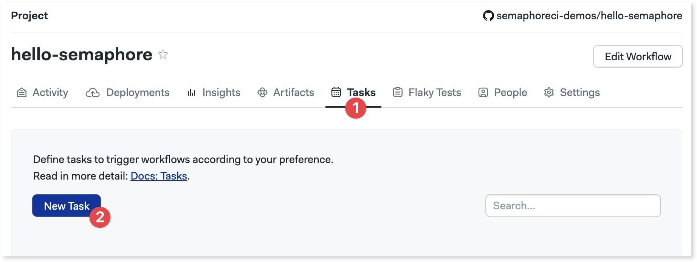
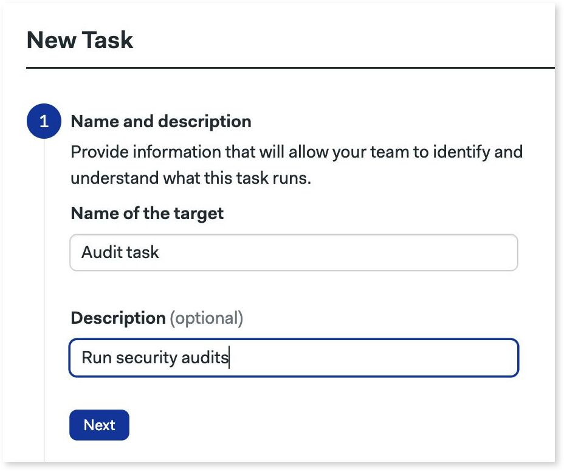
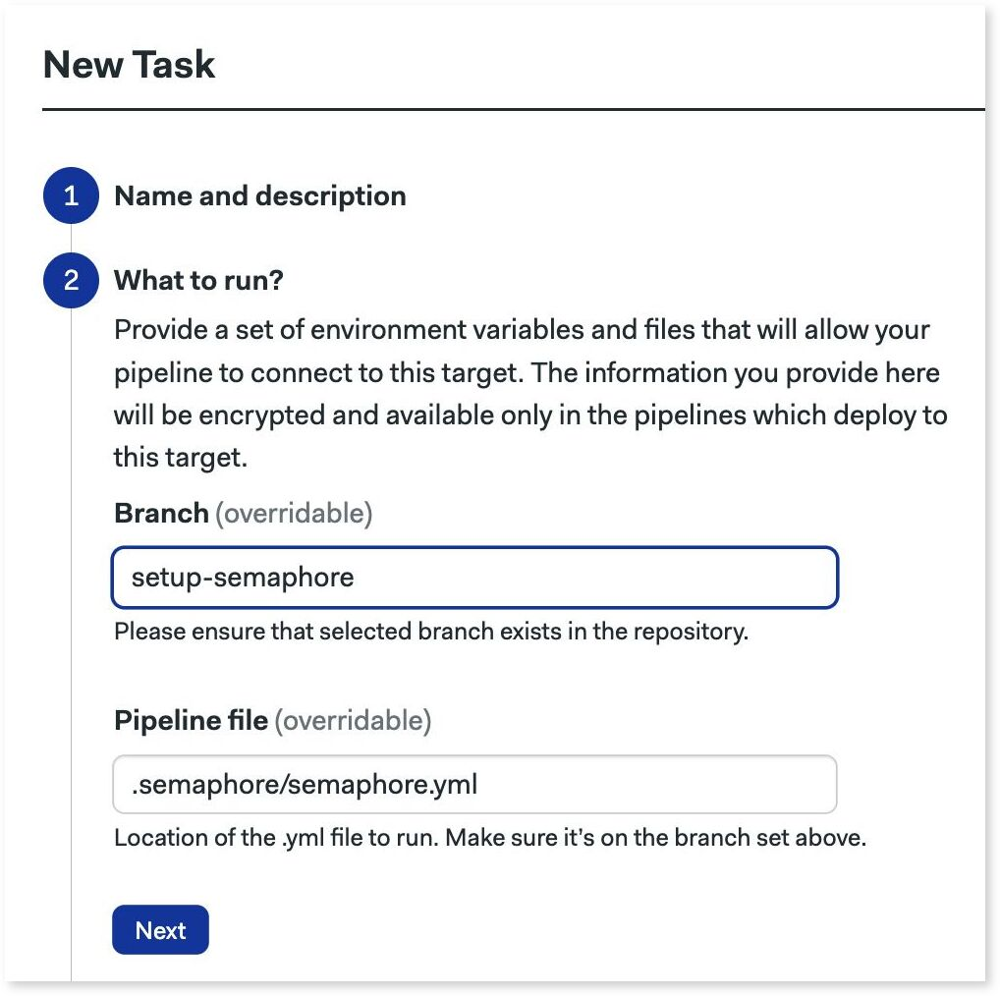
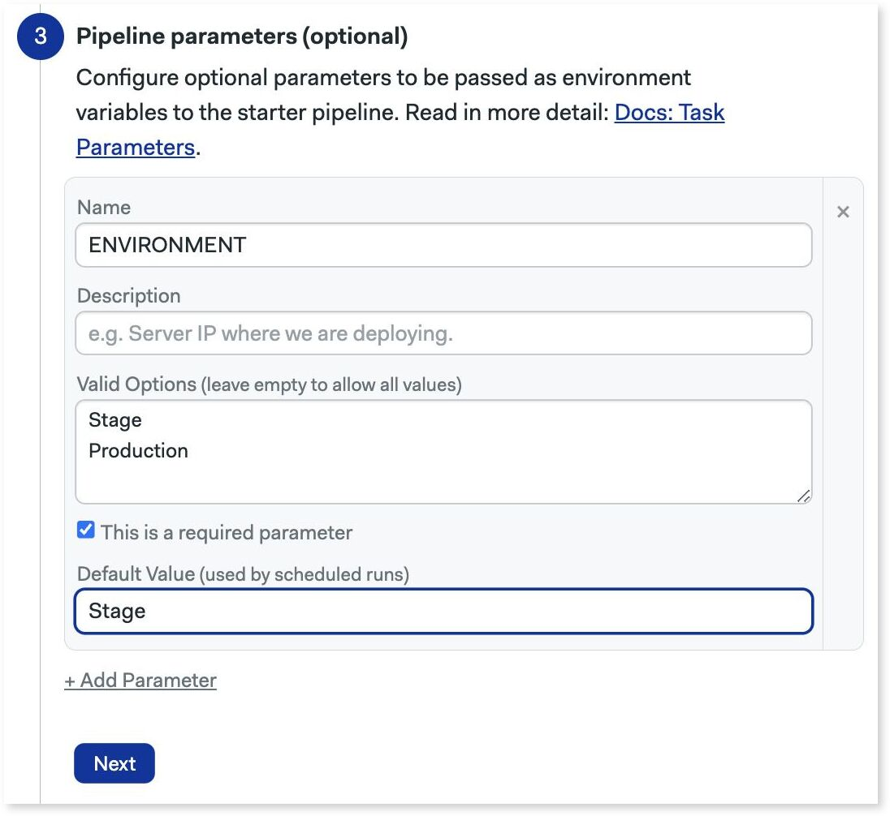
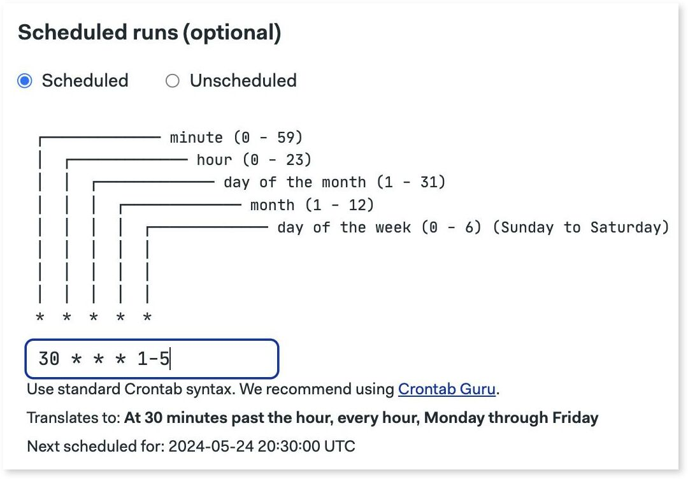

# Tasks

Task allow you to trigger [pipelines](./pipelines) on a schedule or even manually. 

The main use cases for tasks are to:

- Run long or resource-intensive jobs outside the usual continuous integration workflow.
- Trigger pipelines not connected to any [promotions](./pipelines#promotions)
- Periodically rebuild an application or run security audits
- Continue testing projects even when they are inactive (not getting new commits)
- Run arbitrary code, track results, and get notifications
- Execute maintenance chores such as such database backups
- Running exceptional corrective actions such as pruning the [cache](./jobs#cache)

## Limitations

Scheduled tasks have some limitations:

- Pipelines are triggered at a random second inside the scheduled minute. This helps disperse the load on the system.
- Tasks will not start automatically in the first 60 seconds after being created or edites.
- In the rare cases in which the scheduler fails to start a task, Semaphore will retry it every 10 seconds for the following 15 minutes.

## How to create a task

To create a task, open your project and follow these steps:

1. Select the **Tasks** tab
2. Press **New task**
        

        
Show me

        

            
        

        
  
3. Type the task's name and description
4. Press **Next**
    

        
Show me

        

        
        

    

5. Type the repository branch and [pipeline](./pipelines) file to execute. The only requisite is that the pipeline file exists in that branch. It doesn't need (but it can) to be conencted with a promotion to any other pipeline
6. Press **Next**
    

        
Show me

        

        
        

    

7. Optionally, you can add parameters. These work exacly the same as [parameterized promotions](./pipelines#parameters)
    

        
Show me

        

        
        

    

8. Press **Next**
9. Define the schedule using [crontab syntax](https://crontab.guru/). The example below is running Check the option "Unscheduled" if you want to only run the task manually
    

        
Show me

        

        
        

    

10. Press **Next** and **Create**

## How to run tasks manually

Scheduled or unscheduled tasks can always be started manually.

## How to deactivate a task

## How to view task history

---

You can pass [parameters](./pipelines#parameters) to the pipeline to control it's behavior.

Pipelines running with tasks don't need to be connected with [a promotion](./pipelines#promotions). In other words, you can create special, task-only pipelines to run your maintenance work separate from continuous integration.

Scheduling workflow runs daily, hourly, or even every other minute might be handful in many use cases, such as:

Periodically performing long or resource-intensive tests that should not be triggered on every push.
If your application delivery process requires periodic builds.
When you have an inactive project but would like to be sure that the code still works with its dependencies.
An easy way to periodically execute arbitrary code, track results, and receive notifications.
Manually-triggered workflow runs complement the mentioned range to give a full control over the execution of CI/CD workflows. Here are some example cases:

repeated jobs performed under specific circumstances (for instance, database maintenance)
quality control of your CI/CD environment performed on demand
provisioning and setting up resources with your cloud provider
exceptional corrective actions (e.g. pruning the cache)